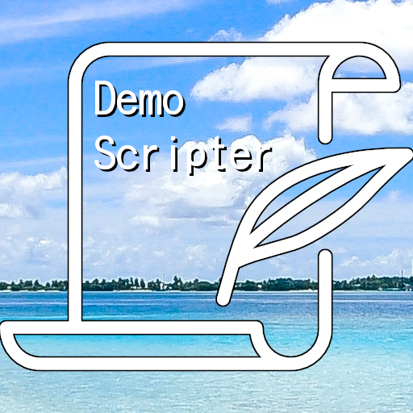

# Demo Scripter

**Demo Scripter** is a visual novel framework inspired by NScripter made in Godot.

The current version of Demo Scripter is for Godot 4.2

## Features
* Multiple set of dialogue
* Fast Skip Button
* Run a function in a specific dialogue ID
* Delay text
* Go to next dialogue automatically after a dialogue is finished
* Text animation
* Icon that appears after text is finished displaying
* Character Class

## Documentation
The [documentation](./docs/overview.md) explains how to use the framework, features, etc

## Notice
The resolution of VisualNovelScene_hud is 720x540 (you can change the size if you like)

## Disclaimer
- The framework is in alpha stage and there are features not finished.
- API is subject to changes.
- Currently Demo Scripter is not implemented as a addon (yet), meaning you will need to download the scenes and scripts folder manually.
- The documentation is incomplete.
