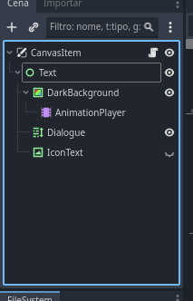

# Creating a basic dialogue scene
1. Create a new CanvasLayer scene
2. Duplicate the VisualNovelScene_hud.tscn scene into the new CanvasLayer scene (make the HUD scene local)
3. Add a script to the new scene which extends DemoScripter_VisualNovelScene
4. Paste the example code
5. Run the scene
6. By pressing space (or any key binded to ui_accept), the text should proceed!

In step 2, the tree should look like this:



## Example code
```gdscript
extends DemoScripter_VisualNovelScene


func _ready() -> void:
	add_dialogue_start("Hello World!")
	add_dialogue("testing dialogue")
	add_dialogue("test again moment")
	
	add_dialogue_start("This one is the next page", 2)
	add_dialogue("very cool")
	add_dialogue("moment")
	
	load_dialogue_start()


func _on_end_dialogue_signal() -> void:
	end_dialogue()
```

### In game screenshot
Note: The resolution of the project in this screenshot is set to 720x540 (the same of VisualNovelScene_hud.tscn)


## Other examples
I made a [repository](https://github.com/Lukaswbrr/Demo-Scripter-Examples) which shows more examples using the framework.

# Adding dialogue
In the example above shows a very basic way of adding dialogue to a visual novel scene.

However, there are more functions related to dialogue, for example, creating dialogue on a different page, a different set, running functions, etc.

>[!NOTE] 
>Sets are like different groups of dialogue.
>By default, "start" is the main set of the dialogue.
>Sets can go to different sets, for example, you can use a button handler which shows different options that goes to a different set!
>Like "start" > "choice1" or "start" > "choice2".

## Dialogue Next function
Using the example above as reference, instead of setting manually the id using add_dialogue_start, you can use add_dialogue_next to create a new dialogue on a next page automatically!

```gdscript
extends DemoScripter_VisualNovelScene


func _ready() -> void:
	add_dialogue_start("Hello World again!")
	add_dialogue("testing dialogue again")
	add_dialogue("test again moment -again-")
	
	add_dialogue_next("This one is the next page, which automatically incremented to the next page without needing to set it manually!")
	add_dialogue("very cool")
	add_dialogue("moment")
	add_dialogue("amogus")
	
	load_dialogue_start()


func _on_end_dialogue_signal() -> void:
	end_dialogue()
```

## Dialogue Special
Dialogue specials is a type of dialogue that runs the function the moment the dialogue index is on the above dialogue line.

You can use this alongside Background Handler to change backgrounds, change characters emotions, positions, etc!

### Test function example
### Test function with arguments example
### Characters example
### Background handler example
### Playing music example


# Creating characters using the framework
W.I.P

# Playing audio using the framework
W.I.P
