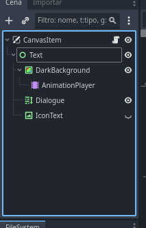
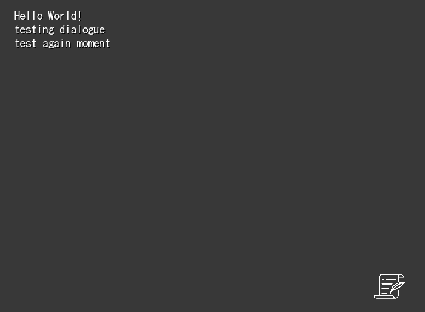

# Creating a basic dialogue scene
1. Create a new CanvasLayer scene
2. Duplicate the VisualNovelScene_hud.tscn scene into the new CanvasLayer scene (make the HUD scene local)
3. Add a script to the new scene which extends DemoScripter_VisualNovelScene
4. Paste the example code
5. Run the scene
6. By pressing space (or any key binded to ui_accept), the text should proceed!

In step 2, the tree should look like this:


## Example code
```gdscript
extends DemoScripter_VisualNovelScene


func _ready() -> void:
	add_dialogue_start("Hello World!")
	add_dialogue("testing dialogue")
	add_dialogue("test again moment")
	
	add_dialogue_start("This one is the next page", 2)
	add_dialogue("very cool")
	add_dialogue("moment")
	
	load_dialogue_start()


func _on_end_dialogue_signal() -> void:
	end_dialogue()
```

### In game screenshot
Note: The resolution of the project in this screenshot is set to 720x540 (the same of VisualNovelScene_hud.tscn)



# Adding dialogue
W.I.P

# Creating characters using the framework
W.I.P

# Playing audio using the framework
W.I.P
