>[!WARNING]
>In the future when DemoScripter is available as a Godot Addon, it's planned for DemoScripter to have a unique addon menu where you can create dialogue scenes and save them as Resources files! (which you can make translations on the addon menu too, making it easier to translate and save as .csv file)
>This page MAY be obsolute in the future and only be used for legacy purposes. (but for now, it inst.)

# Creating a basic dialogue scene

1. Create a new CanvasLayer scene
2. Duplicate the VisualNovelScene_hud.tscn scene into the new CanvasLayer scene (make the HUD scene local)
3. Add a script to the new scene which extends DemoScripter_VisualNovelScene
4. Paste the example code
5. Run the scene
6. By pressing space (or any key binded to ui_accept), the text should proceed!

In step 2, the tree should look like this:

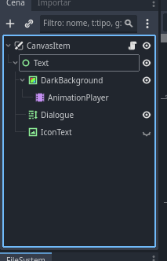

## Example code

```gdscript
extends DemoScripter_VisualNovelScene


func _ready() -> void:
	add_dialogue_start("Hello World!")
	add_dialogue("testing dialogue")
	add_dialogue("test again moment")
	
	add_dialogue_start("This one is the next page", 2)
	add_dialogue("very cool")
	add_dialogue("moment")
	
	load_dialogue_start()


func _on_end_dialogue_signal() -> void:
	end_dialogue()
```

### In game screenshot

Note: The resolution of the project in this screenshot is set to 720x540 (the same of VisualNovelScene_hud.tscn)


## Other examples

I made a [repository](https://github.com/Lukaswbrr/Demo-Scripter-Examples) which shows more examples using the framework.

# Adding dialogue

In the example above shows a very basic way of adding dialogue to a visual novel scene.

However, there are more functions related to dialogue, for example, creating dialogue on a different page, a different set, running functions, etc.

>[!NOTE]
>Always remember to connect the end dialogue signal scene to the script!
>Otherwise, the dialogue wouldn't end!

## Dialogue Next function

Using the example above as reference, instead of setting manually the id using add_dialogue_start, you can use add_dialogue_next to create a new dialogue on a next page automatically!

```gdscript
extends DemoScripter_VisualNovelScene


func _ready() -> void:
	add_dialogue_start("Hello World again!")
	add_dialogue("testing dialogue again")
	add_dialogue("test again moment -again-")
	
	add_dialogue_next("This one is the next page, which automatically incremented to the next page without needing to set it manually!")
	add_dialogue("very cool")
	add_dialogue("moment")
	add_dialogue("amogus")
	
	load_dialogue_start()


func _on_end_dialogue_signal() -> void:
	end_dialogue()
```

## Dialogue Special

Dialogue specials is a type of dialogue that runs the function the moment the dialogue index is on the above dialogue line.

You can use this alongside Background Handler to change backgrounds, change characters emotions, positions, etc!

### Test function example

Here is a example with a custom defined function on the same scene, running add_dialogue_special.

The moment the index reaches 3, which is test dialogue special 2, it will run the function print_no_args, outputting !Hello World!" on the console.

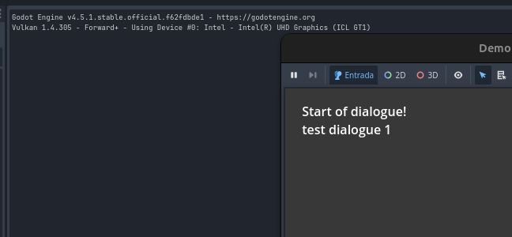
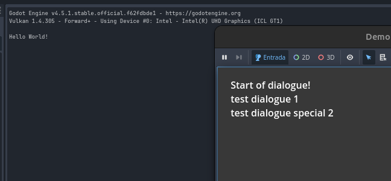

```gdscript
extends DemoScripter_VisualNovelScene

func _ready() -> void:
	add_dialogue_start("Start of dialogue!")
	add_dialogue("test dialogue 1")
	add_dialogue("test dialogue special 2")
	add_dialogue("test dialogue 3")
	add_dialogue("test dialogue 4")
	
	load_dialogue_start()

func print_no_args() -> void:
	print("Hello World!")

func _on_end_dialogue_signal() -> void:
	end_dialogue()
```

### Test function with arguments example

Here is a example using a custom function that has two arguments.

You can execute the arguments in the second argument of add_dialogue_special, which is a array argument (accepts multiples arguments of the function you're calling.)

This example also includes the previous no arguments function!

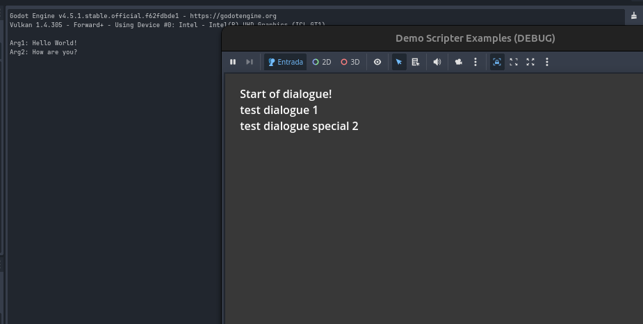
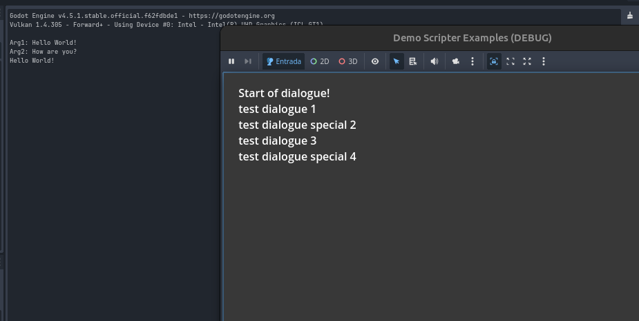

```gdscript
extends DemoScripter_VisualNovelScene

func _ready() -> void:
	add_dialogue_start("Start of dialogue!")
	add_dialogue("test dialogue 1")
	add_dialogue("test dialogue special 2")
	add_dialogue_special(print_args, ["Hello World!", "How are you?"])
	add_dialogue("test dialogue 3")
	add_dialogue("test dialogue special 4")
	add_dialogue_special(print_no_args)
	
	load_dialogue_start()

func print_args(arg1: String, arg2: String) -> void:
	print("Arg1: " + arg1)
	print("Arg2: " + arg2)

func print_no_args() -> void:
	print("Hello World!")

func _on_end_dialogue_signal() -> void:
	end_dialogue()

```

### Character example

>[!NOTE]
>This will be used the Arcueid's character example!
>You can follow the creating a character section for the arcueid example or copy the arcueid folder from examples/characters to your godot project.

In this example, it will be tested functionality for making a character visible, change emotions, positions and make it invisible!

Once you have a character done, in this case Arcueid, create a Node2D named Characters in your visual novel scene. This is where the characters will be added.

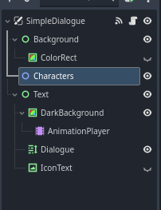

>[!NOTE]
>You can add a control named Background with a ColorRect on it, if you want. It's just for a simple color background. (which is not used in the example)

Then, instantiate arcueid scene on Characters node.

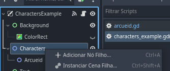
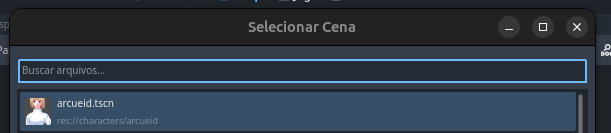

Here is the code used for the example.

```gdscript
extends DemoScripter_VisualNovelScene


func _ready() -> void:
	add_dialogue_start("character example!")
	add_dialogue("angry")
	add_dialogue_special(set_character_emotion, [$Characters/Arcueid, "angry"])
	add_dialogue("angry 2")
	add_dialogue_special(set_character_emotion, [$Characters/Arcueid, "angry_2"])
	add_dialogue("surprised")
	add_dialogue_special(set_character_emotion, [$Characters/Arcueid, "SURPRISED"])
	
	add_dialogue_next("back to normal")
	add_dialogue_special(set_character_emotion, [$Characters/Arcueid, "NORMAL"])
	add_dialogue("doubt emotion")
	add_dialogue_special(set_character_emotion, [$Characters/Arcueid, "DOUBT"])
	add_dialogue_quote("Testing quote dialogue thing.")
	add_dialogue("yeah")
	add_dialogue_continue("it works")
	
	add_dialogue_next("testing left")
	add_dialogue_special(setpos_character, [$Characters/Arcueid, "left"])
	add_dialogue("right")
	add_dialogue_special(setpos_character, [$Characters/Arcueid, "right"])
	add_dialogue("back to middle")
	add_dialogue_special(setpos_character, [$Characters/Arcueid, "middle"])
	add_dialogue("yipeee")
	
	load_dialogue_start()
```

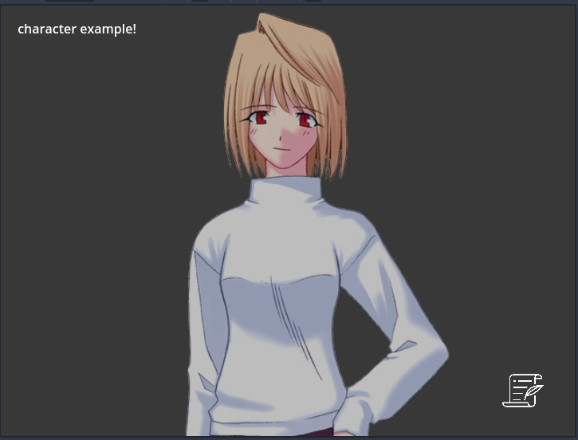
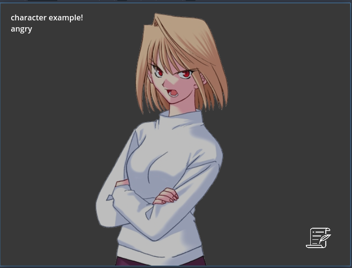
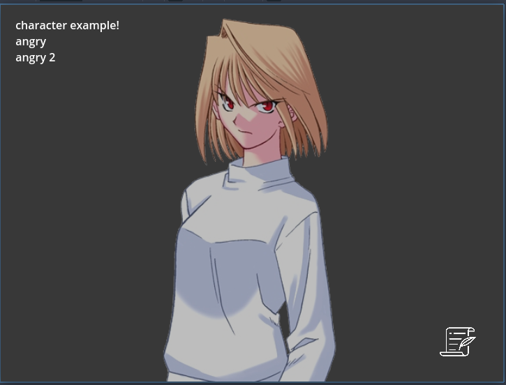
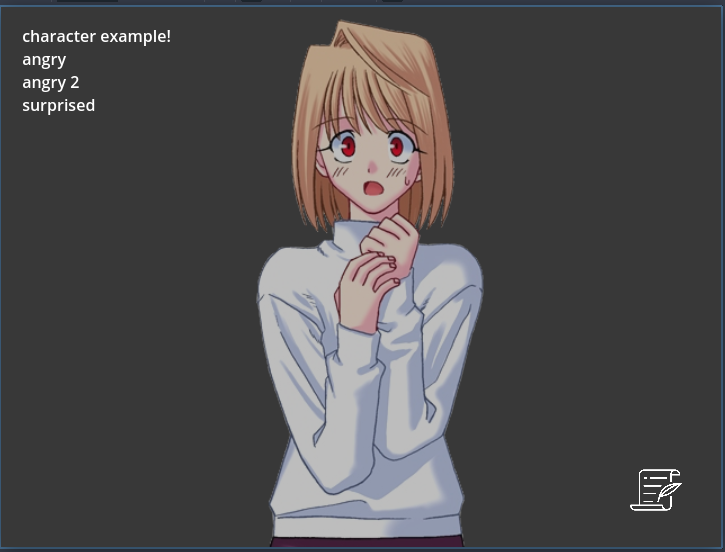
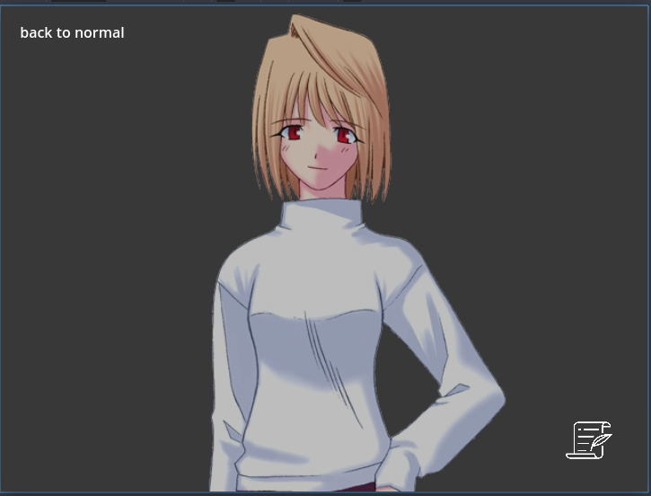
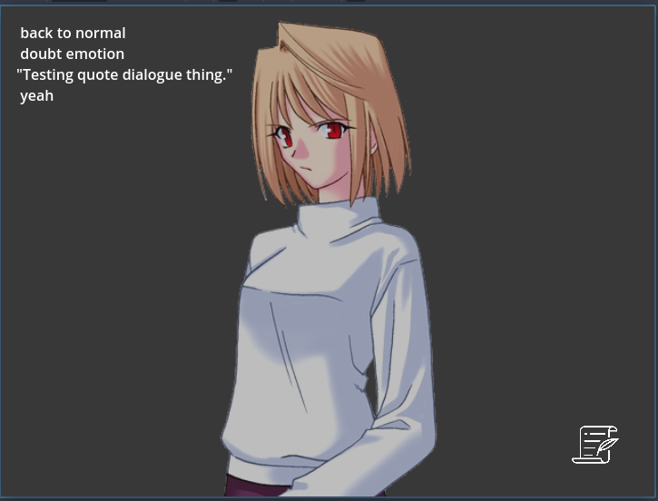

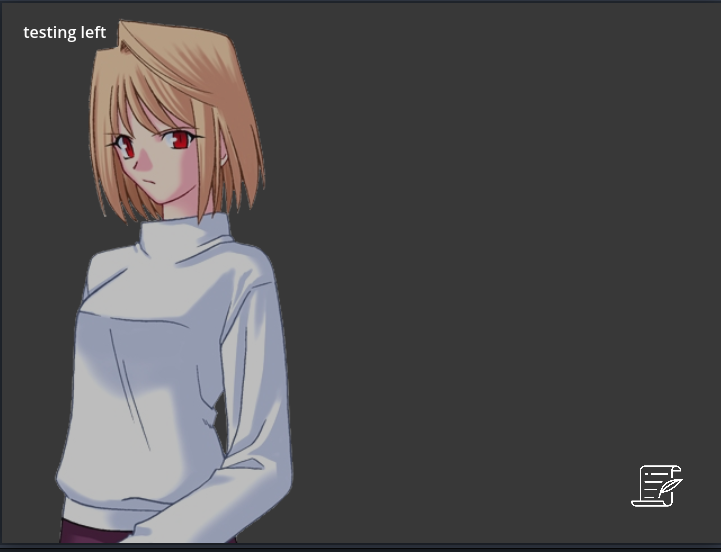
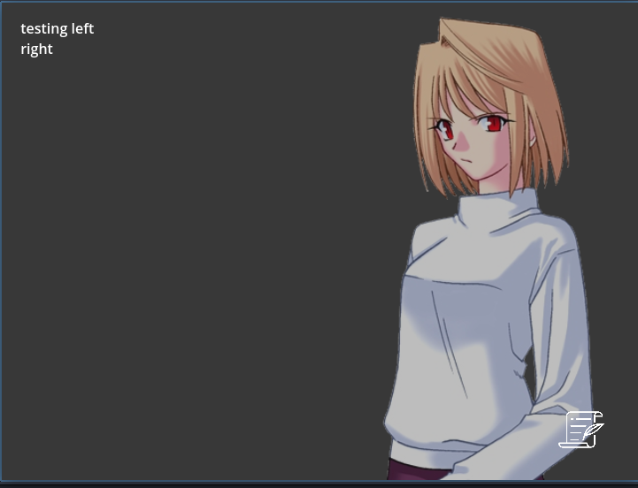
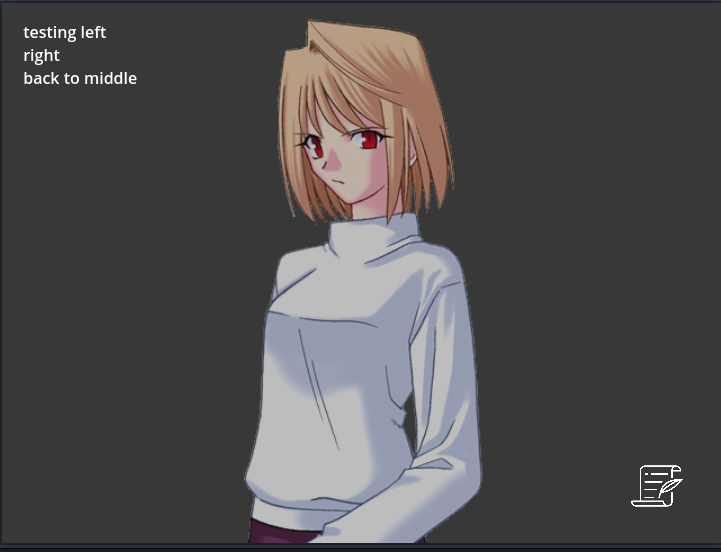
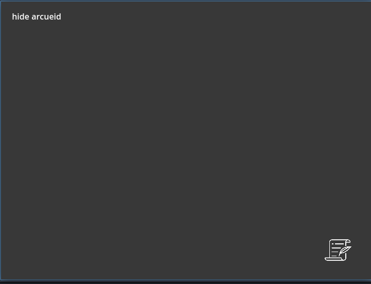
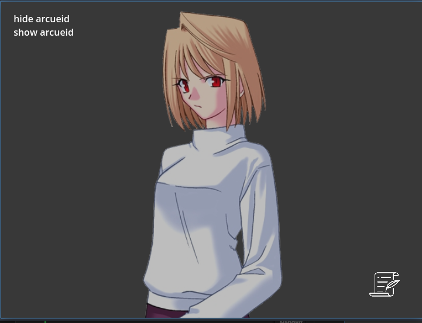
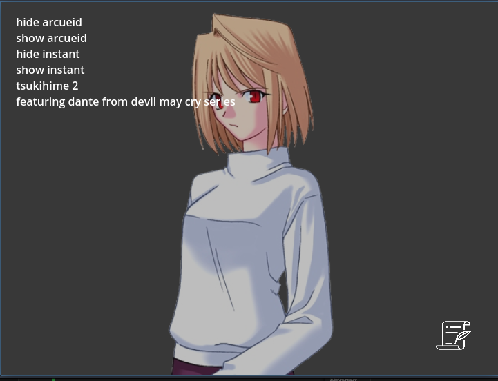

The set_character_emotion sets the character's emotion. Most of the functions has a _instant variation, which means they get executed without the hud fading in and out! (and the _instant functions gets executed once the fade out animation finishes or fast_skip button is held.)

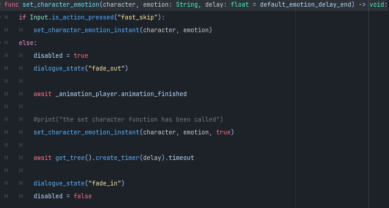

It's optional if you want to type the emotions argument in uppercase or lowercase since it automatically sets the argument to uppercase!

add_dialogue_quote automatically creates a dialogue between "".

add_dialogue_continue creates a dialogue in the same line.

setpos_character sets the character pos to a specific side. It uses the exported variables of position from the character!

hide_character makes the character invisible and show_character makes the character visible. the _instant variations doesnt trigger the hud fade animation.

### Background handler example

>[!NOTE]
>This uses the Background Handler created via the Adding backgrounds for the framework example!
>You can follow that section on how to add backgrounds for the framework.
>This also uses the Arcueid example from Adding characters to the framework!

In this example, it will be used the Background Handler node to handle backgrounds, which includes background transitions, etc!

Keep in mind, the current scene for this test looks like this.
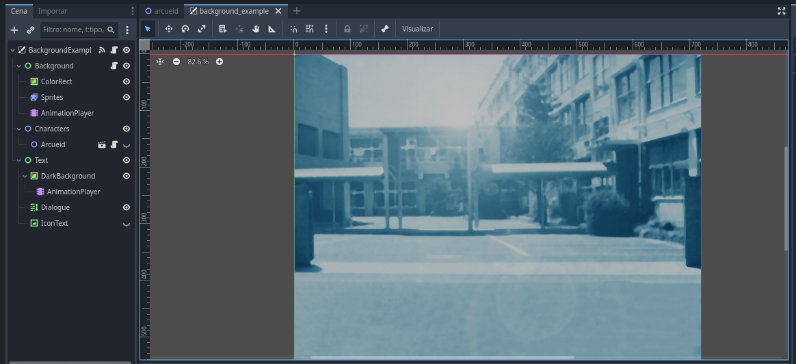

```gdscript
extends DemoScripter_VisualNovelScene

@onready var background: DemoScripter_BackgroundHandler = $Background

func _ready() -> void:
	add_dialogue_start("background example!")
	add_dialogue("normal background")
	add_dialogue("change to sprite 1")
	add_dialogue_special(background.change_background_transition, [1, "default", 2])
	add_dialogue("change to sprite 3")
	add_dialogue_special(background.change_background_transition, [3, "default", 2])
	add_dialogue("change to sprite 7")
	add_dialogue_special(background.change_background_transition, [7, "default", 2])
	add_dialogue("short change to sprite 10")
	add_dialogue_special(background.change_background_transition, [10, "default", 1])
	add_dialogue("long change to sprite 11")
	add_dialogue_special(background.change_background_transition, [11, "default", 3])
	
	add_dialogue_next("back to sprite 0")
	add_dialogue_special(background.change_background_transition, [0, "default", 1])
	add_dialogue("uhuh")
	
	add_dialogue_next("now with character visible")
	add_dialogue_special(show_character, [$Characters/Arcueid])
	add_dialogue("change to sprite 3")
	add_dialogue_special(background.change_background_transition, [3, "default", 2])
	add_dialogue("the background gets in front of the character, making the character hidden!")
	add_dialogue("appear arcueid again")
	add_dialogue_special(show_character, [$Characters/Arcueid])
	add_dialogue("change to sprite 5 persistant")
	add_dialogue_special(background.change_background_transition, [5, "default", 2, {
		"persistant_chars": true,
		"hide_characters_on_end": false
	}])
	add_dialogue("now the character is on front!")
	add_dialogue("very cool...")
	
	add_dialogue_next("back to sprite 0, once again")
	add_dialogue_special(background.change_background_transition, [0, "default", 2])
	add_dialogue("background fade in")
	add_dialogue_special(background.background_fade_in, [2])
	add_dialogue("background fade out")
	add_dialogue_special(background.background_fade_out, [2])
	add_dialogue("arcueid appear again")
	add_dialogue_special(show_character, [$Characters/Arcueid]) 
	add_dialogue("fade in again")
	add_dialogue_special(background.background_fade_in, [2])
	add_dialogue("fade out again")
	add_dialogue_special(background.background_fade_out, [2])
	add_dialogue("as you can see, arcueid disappeared during the fade in animation!")
	add_dialogue("arcueid appear again -again-")
	add_dialogue_special(show_character, [$Characters/Arcueid]) 
	add_dialogue("fade in again -again-")
	add_dialogue_special(background.background_fade_in, [2, {
		"hide_characters": false
	}])
	add_dialogue("while arcueid got affected by the fadein effect, arcueid didnt completely disappear!")
	
	add_dialogue_next("back to normal again")
	add_dialogue_special(background.background_fade_out, [2])
	add_dialogue("test blink")
	add_dialogue_special(background.rect_blink, [1, 1])
	add_dialogue("quick blink")
	add_dialogue_special(background.rect_blink, [0.3, 0.3])
	add_dialogue("by default, characters dont disappear during the effect of rect blink")
	add_dialogue("hide characters test")
	add_dialogue_special(background.rect_blink, [0.3, 0.3, {
		"hide_characters_in": true
	}])
	add_dialogue("dont hide background test")
	add_dialogue_special(background.rect_blink, [0.3, 0.3, {
		"hold_fadein": 3,
		"hide_background_in": false
	}])
	add_dialogue("only works when you set the hold_fadein argument higher than 0")
	add_dialogue("test colored rect_blink")
	add_dialogue_special(background.rect_blink, [0.5, 0.5, {
		"rect_color": Color8(255, 0, 0)
	}])
	
	load_dialogue_start()

```

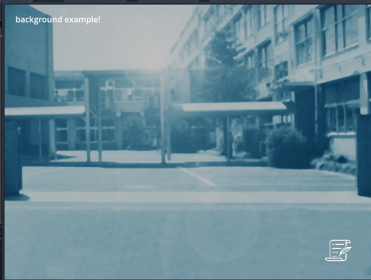
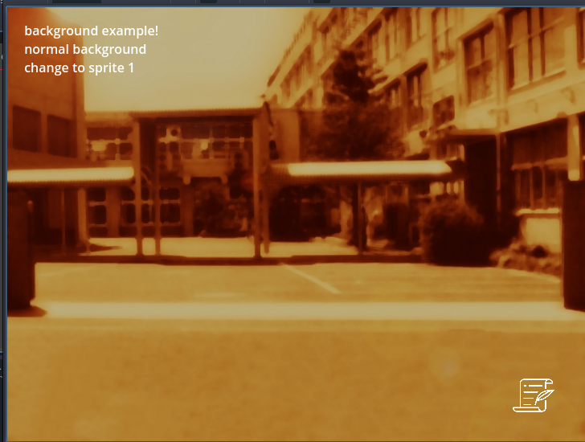
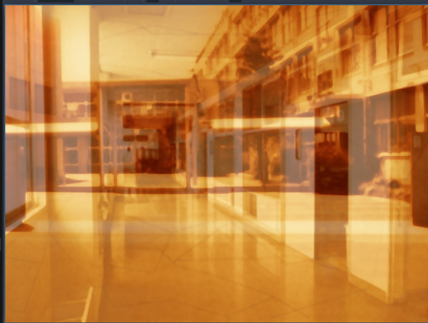
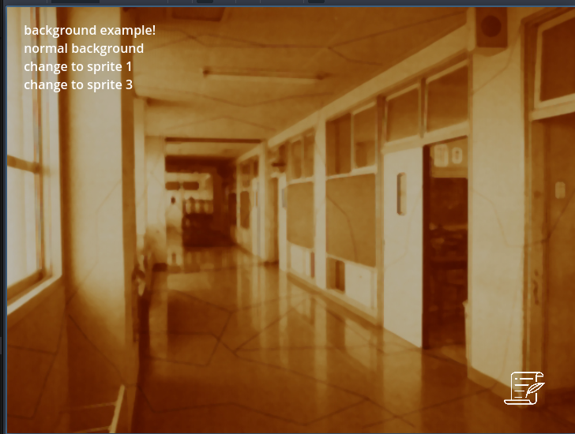
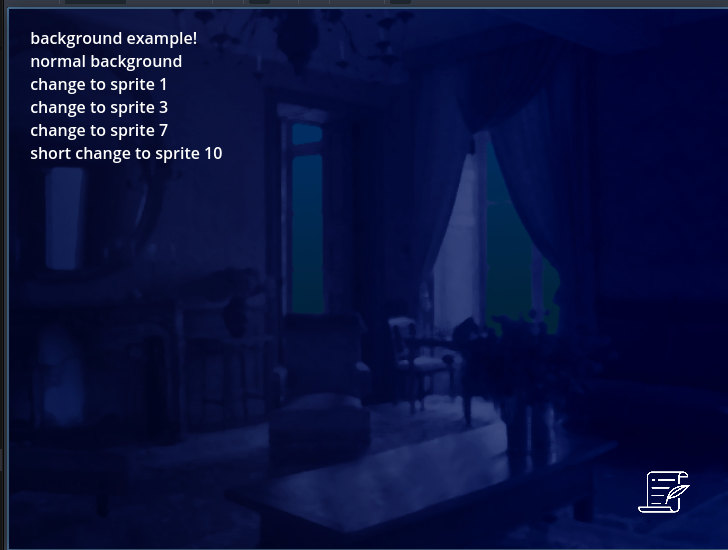
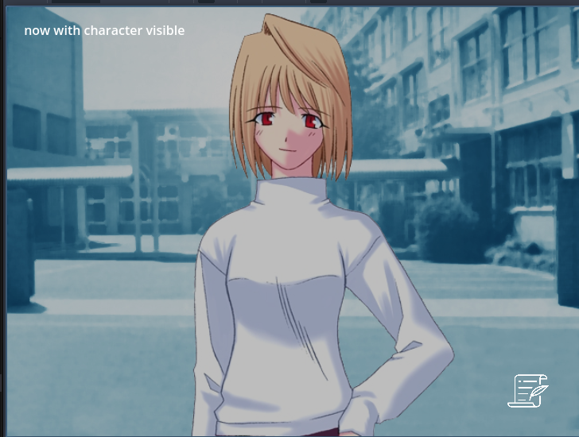
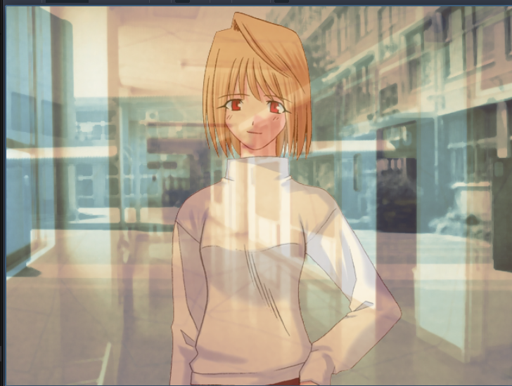
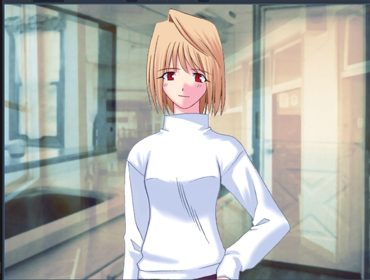
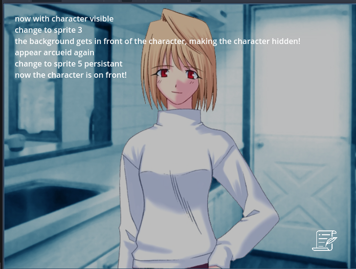
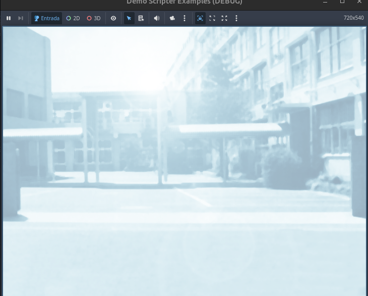
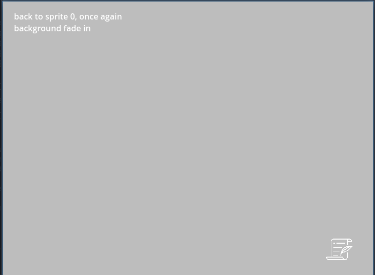

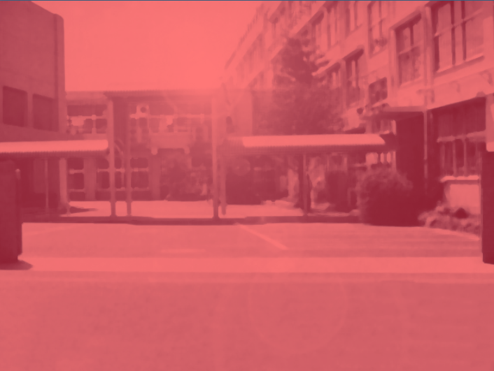
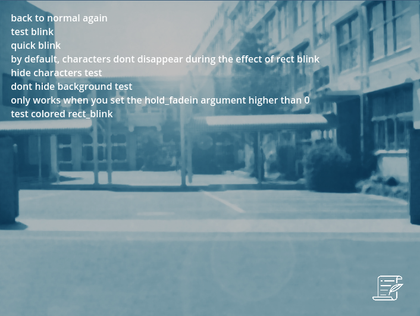

change_background_transition changes the background with a transition effect that fades in the new background on top of the old background. By default, characters get affected by the transition effect. You can enable persistant characters adding { "persistant_chars": true } to the config argument.

background_fade_in fades the background in, which makes it invisible and only making the color behing the Background's Sprites node visible. (ColorRect) Just like change_background_transition, characters get affected by the background fade. You can disable this by using { "hide_characters_in": false } in the config argument.

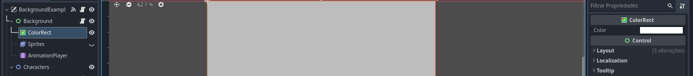

background_fade_out fades the background out.

rect_blink fades the background in and then out. You can set the rect_color temporarily using "rect_color" in the config argument. (it sets back to the original color value background had.) Characters don't disappear during the effect of rect blink by default.

#### Background colors example

>[!NOTE]
>This uses the Background Handler created via the Adding backgrounds for the framework example!
>You can follow that section on how to add backgrounds for the framework.
>This also uses the Arcueid example from Adding characters to the framework!

In this example, it will be shown functions that change the background's colors, including characters color during the transition.

There is a node in this example named Overlay with a child of ColorRect named Color. This ColorRect has a material of CanvasItemShader with blend mode set to multiply. This gets used on add_dialogue_special(background.set_rect_modulate_transition, [Color8(255, 0, 0), 3, $Overlay/Color]) function.

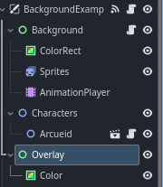
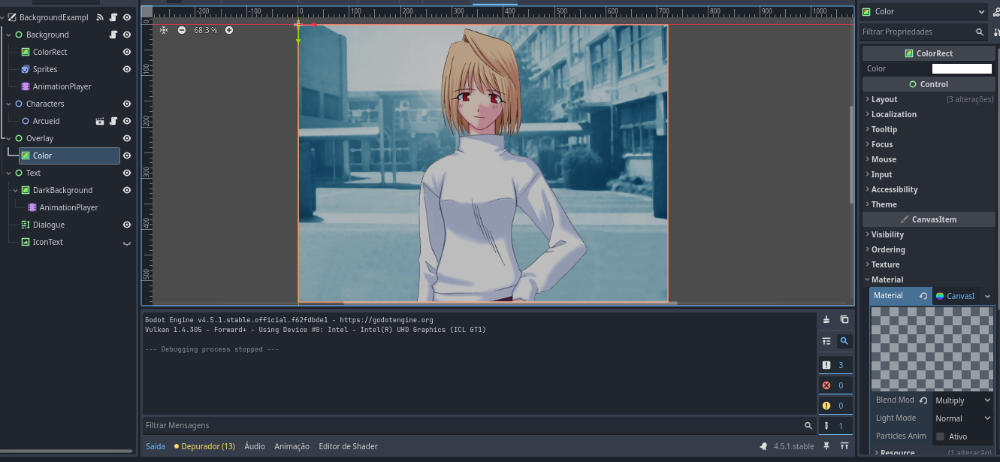

```gdscript
extends DemoScripter_VisualNovelScene

@onready var background: DemoScripter_BackgroundHandler = $Background

func _ready() -> void:
	add_dialogue_start("background second example!")
	add_dialogue("arghh")
	
	add_dialogue_next("test background color")
	add_dialogue_special(background.set_background_modulate, [Color8(255, 0, 0)])
	add_dialogue("this causes the background's color to change without transition")
	add_dialogue("back to normal")
	add_dialogue_special(background.set_background_modulate, [Color8(255, 255, 255)])
	
	add_dialogue_next("background modulate transition")
	add_dialogue_special(background.set_background_modulate_transition, [Color8(255, 0, 0), 3])
	add_dialogue("this only sets the modulate to the background!")
	add_dialogue("back to normal again")
	add_dialogue_special(background.set_background_modulate_transition, [Color8(255, 255, 255), 1])
	
	add_dialogue_next("background modulate all transition")
	add_dialogue_special(background.set_background_modulate_transition_all, [Color8(255, 0, 0), 3])
	add_dialogue("this sets the background and the characters modulate to a specific value")
	add_dialogue("back to normal again again")
	add_dialogue_special(background.set_background_modulate_transition_all, [Color8(255, 255, 255), 1])
	
	add_dialogue_next("testing ColorRect with CanvasItemMaterial with blend mode on multiply transition")
	add_dialogue_special(background.set_rect_modulate_transition, [Color8(255, 0, 0), 3, $Overlay/Color])
	add_dialogue("back to normal again again again")
	add_dialogue_special(background.set_rect_modulate_transition, [Color8(255, 255, 255), 1, $Overlay/Color])
	add_dialogue("with this treasure, i summon..............")

	
	load_dialogue_start()
```

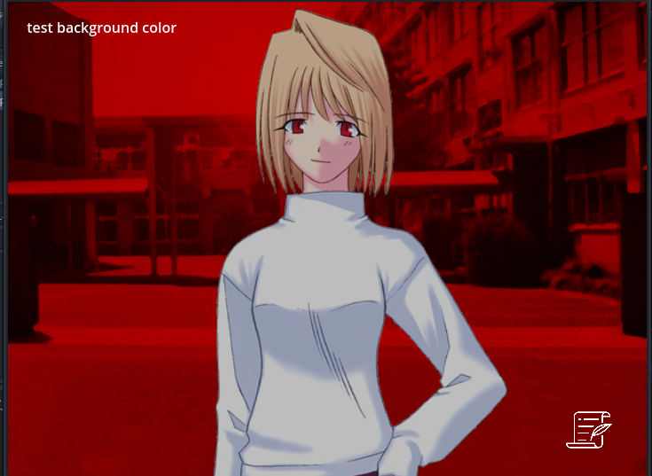
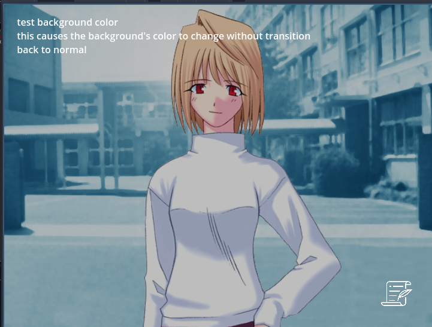
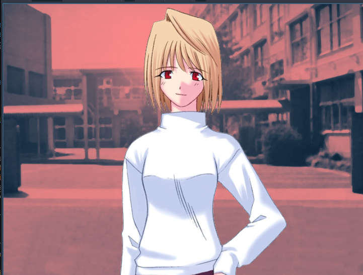
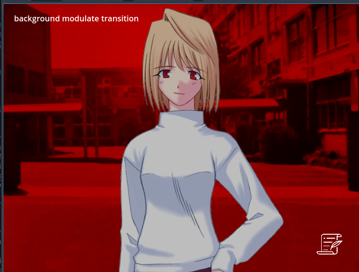
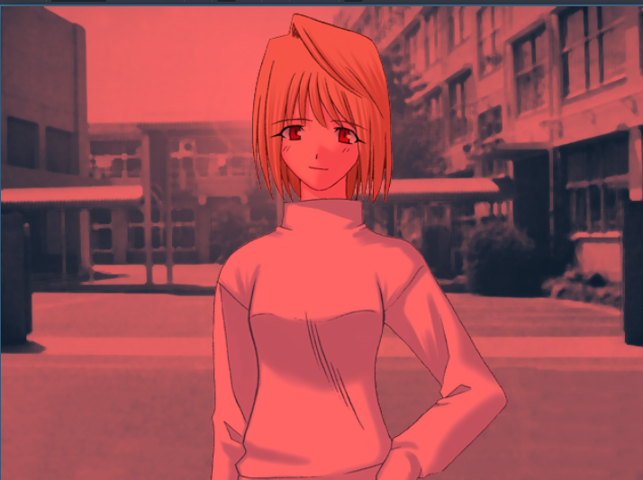
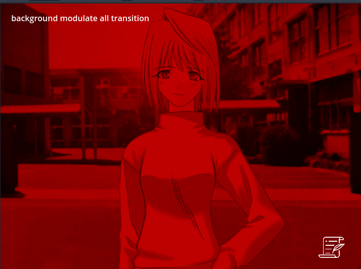
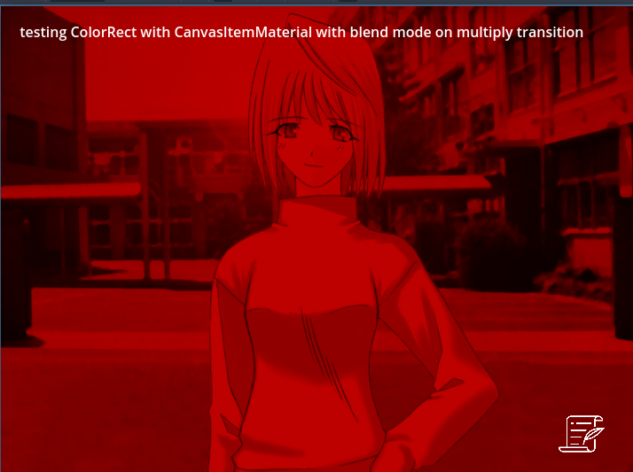

set_background_modulate sets the background's modulate (color) after the fade out animation of HUD finishes.

set_background_modulate_transition sets the background's modulate (color) using a transition. This doesn't affect characters.

set_background_modulate_transition_all sets the background's modulate (color) using a transition. This affect characters.

set_rect_modulate_transition sets a ColorRect to a specific modulate (color) with a transition. This was used to set the ColorRect from Overlay node, which affected the background and characters (alternative to set_background_modulate_transition_all and allows characters to have their own modulate instead of being forced to be on the specific modulate from set_background_modulate_transition_all.)

#### Transition shader example

>[!NOTE]
>This example uses [Pixelated diamond directional fading transition](https://godotshaders.com/shader/pixelated-diamond-directional-fading-transition/) by [Joey Bland](https://godotshaders.com/author/joey_bland/) on [Godot Shaders](https://godotshaders.com/). The example folder includes a shader folder which contains this shader.

>[!NOTE]
>This uses the Background Handler created via the Adding backgrounds for the framework example!
>You can follow that section on how to add backgrounds for the framework.
>This also uses the Arcueid example from Adding characters to the framework!

This example showcases a custom shader for transitions!

```gdscript
extends DemoScripter_VisualNovelScene

@onready var background: DemoScripter_BackgroundHandler = $Background

func _ready() -> void:
	add_dialogue_start("background third example!")
	add_dialogue("this is for showcasing transition with shaders")
	add_dialogue_next("test transition")
	add_dialogue_special(background.change_background_effect, [2, "default", "res://Demo-Scripter/docs/examples/shaders/transition_shadermaterial.tres", "height", 1, -1, 3, 3])
	add_dialogue("this is a horizontal shader transition!")
	add_dialogue_next("change background to 3")
	add_dialogue_special(background.change_background_effect, [3, "default", "res://Demo-Scripter/docs/examples/shaders/transition_shadermaterial.tres", "height", 1, -1, 3, 3])
	add_dialogue("pretty cool")
	
	add_dialogue_next("background effect fade in")
	add_dialogue_special(background.background_effect_in, ["res://Demo-Scripter/docs/examples/shaders/transition_shadermaterial.tres", "height", 1, 3])
	add_dialogue("uhuh")
	add_dialogue("background effect fade out")   
	add_dialogue_special(background.background_effect_out, ["res://Demo-Scripter/docs/examples/shaders/transition_shadermaterial.tres", "height", -1, 3])
	add_dialogue("ok")
	add_dialogue("effect fade in fast")
	add_dialogue_special(background.background_effect_in, ["res://Demo-Scripter/docs/examples/shaders/transition_shadermaterial.tres", "height", 1, 1])
	add_dialogue("fade out normal")
	add_dialogue_special(background.background_fade_out, [3])
	add_dialogue("cool")
	
	add_dialogue_next("fade in normal")
	add_dialogue_special(background.background_fade_in, [1])
	add_dialogue("effect out change background")
	add_dialogue_special(background.background_effect_out_change, [10, "default", "res://Demo-Scripter/docs/examples/shaders/transition_shadermaterial.tres", "height", -1, 3])
	add_dialogue("yeah that worked")
	add_dialogue("change background to frame 7 with right direction")
	add_dialogue_special(background.change_background_effect, [7, "default", "res://Demo-Scripter/docs/examples/shaders/transition_shadermaterial.tres", "height", 1, -1, 3, 3, {
		"quick_direction_fadein": "right",
		"quick_direction_fadeout": "right",
	}])
	add_dialogue("change background to frame 10 with left direction")
	add_dialogue_special(background.change_background_effect, [10, "default", "res://Demo-Scripter/docs/examples/shaders/transition_shadermaterial.tres", "height", 1, -1, 3, 3, {
		"quick_direction_fadein": "right",
		"quick_direction_fadeout": "right",
	}])
	add_dialogue("change background to frame 13 with down direction")
	add_dialogue_special(background.change_background_effect, [13, "default", "res://Demo-Scripter/docs/examples/shaders/transition_shadermaterial.tres", "height", 1, -1, 3, 3, {
		"quick_direction_fadein": "right",
		"quick_direction_fadeout": "right",
	}])
	add_dialogue("that worked too, incredible!")
	
	add_dialogue_next("character test")
	add_dialogue_special(show_character, [$Characters/Arcueid])
	add_dialogue("transition test with character")
	add_dialogue_special(background.change_background_effect, [16, "default", "res://Demo-Scripter/docs/examples/shaders/transition_shadermaterial.tres", "height", 1, -1, 3, 3, {
		"quick_direction_fadein": "right",
		"quick_direction_fadeout": "right",
	}])
	
	add_dialogue_next("different transitions directions 1")
	add_dialogue_special(background.change_background_effect, [20, "default", "res://Demo-Scripter/docs/examples/shaders/transition_shadermaterial.tres", "height", 1, -1, 3, 3, {
		"quick_direction_fadein": "left",
		"quick_direction_fadeout": "up",
	}])
	add_dialogue("different transitions directions 2")
	add_dialogue_special(background.change_background_effect, [4, "default", "res://Demo-Scripter/docs/examples/shaders/transition_shadermaterial.tres", "height", 1, -1, 3, 3, {
		"quick_direction_fadein": "right",
		"quick_direction_fadeout": "down",
	}])
	add_dialogue("yeah, thats cool")
	
	add_dialogue_next("character test again")
	add_dialogue_special(show_character, [$Characters/Arcueid])
	add_dialogue_next("transition without character hide")
	add_dialogue_special(background.change_background_effect, [16, "default", "res://Demo-Scripter/docs/examples/shaders/transition_shadermaterial.tres", "height", 1, -1, 3, 3, {
		"quick_direction_fadein": "right",
		"quick_direction_fadeout": "right",
		"hide_characters_in": false
	}])
	add_dialogue("transition without character hide hold middle")
	add_dialogue_special(background.change_background_effect, [6, "default", "res://Demo-Scripter/docs/examples/shaders/transition_shadermaterial.tres", "height", 1, -1, 3, 3, {
		"quick_direction_fadein": "left",
		"quick_direction_fadeout": "left",
		"hide_characters_in": false,
		"hold_middle": 3
	}])
	add_dialogue("by holding the middle by default, the character appears in the hold middle")
	add_dialogue("to make the character appear again after the effect background, use show_character_out and specific the character inside a array argument")
	add_dialogue("transition with character hide, hold middle and show character out")
	add_dialogue_special(background.change_background_effect, [6, "default", "res://Demo-Scripter/docs/examples/shaders/transition_shadermaterial.tres", "height", 1, -1, 3, 3, {
		"quick_direction_fadein": "left",
		"quick_direction_fadeout": "left",
		"hold_middle": 3,
		"show_character_out": [$Characters/Arcueid]
	}])
	add_dialogue("now the character appears at the fade out!")
	
	load_dialogue_start()

```

background_effect_in does a background fade in using a shader.

background_effect_out does a background fade out using a shader.

background_effect_out_change changes the background first and does a fade out effect using a shader.

change_background_effect changes the background using a shader. This contains a quick_direction config argument that you can set the direction of the shader. (up, right, left, down. the default is up) By default, in the fade out effect, it uses the value argument reversed. (1 becomes -1) You can change this behavior by using tween_type to auto and specifying the tween_from value.

```gdscript
add_dialogue_special(background.change_background_effect, [16, "default", "res://Demo-Scripter/docs/examples/shaders/transition_shadermaterial.tres", "height", 1, -1, 3, 3, {
	"tween_type": "manual",
	"tween_from: 0
}])
```

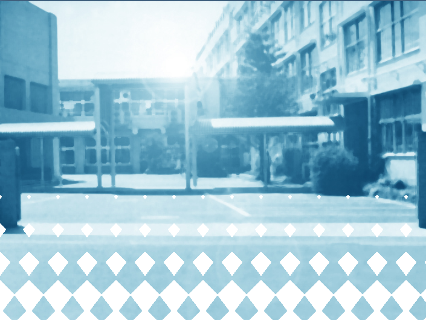
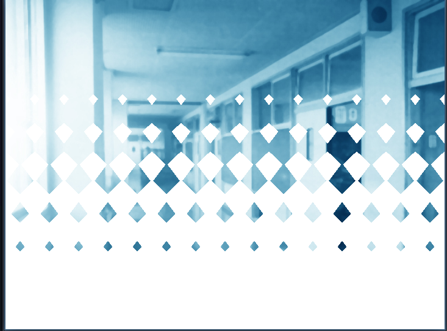
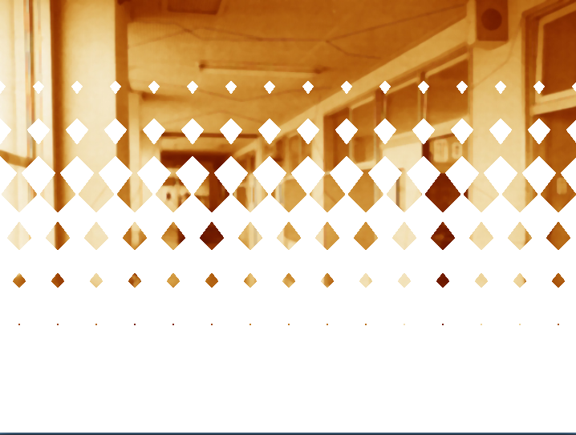
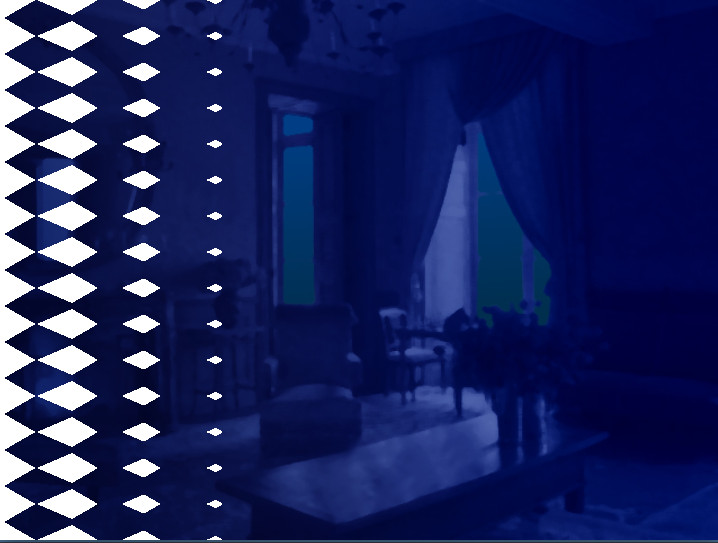
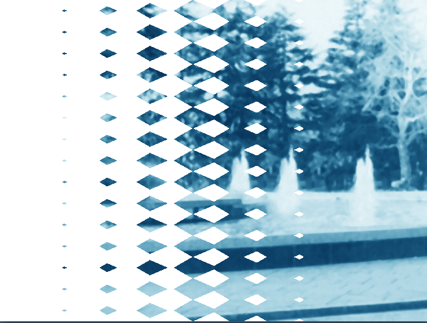
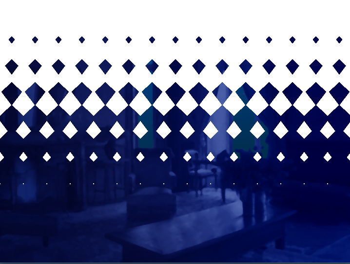
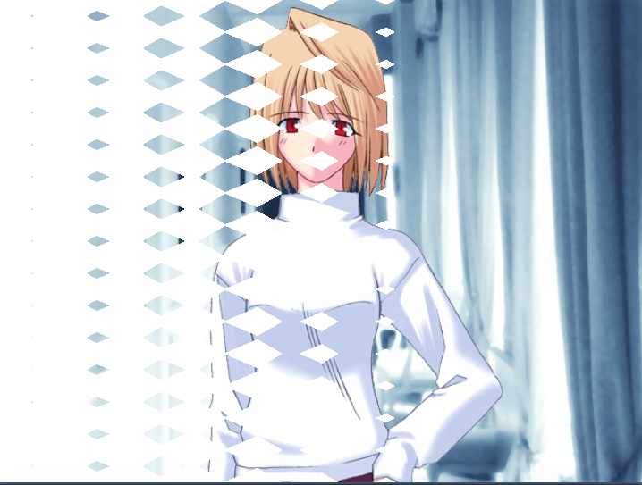
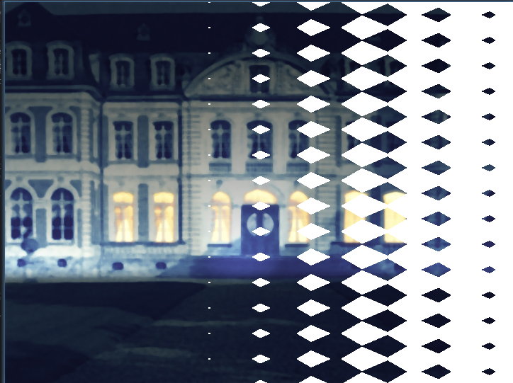
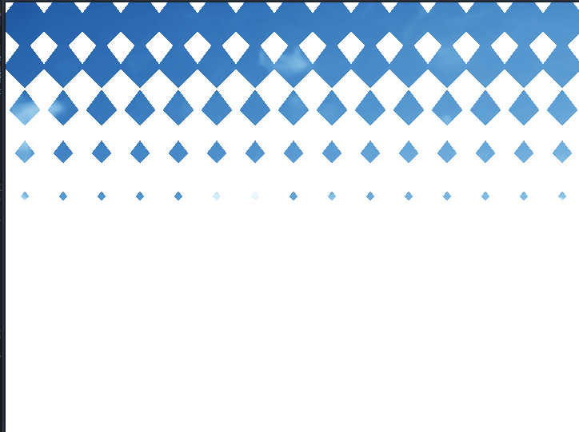
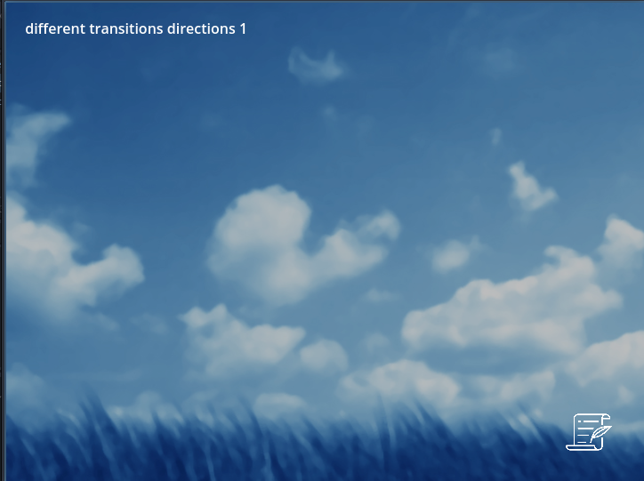
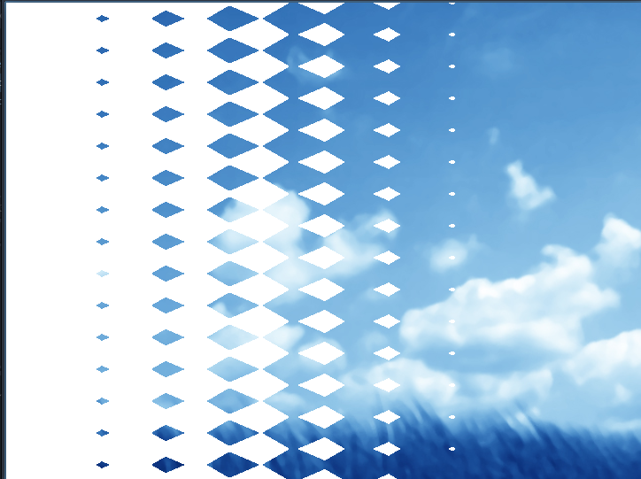
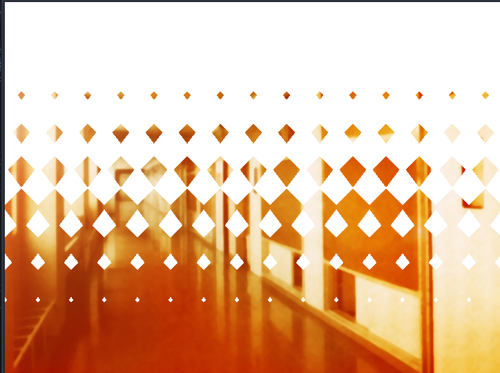
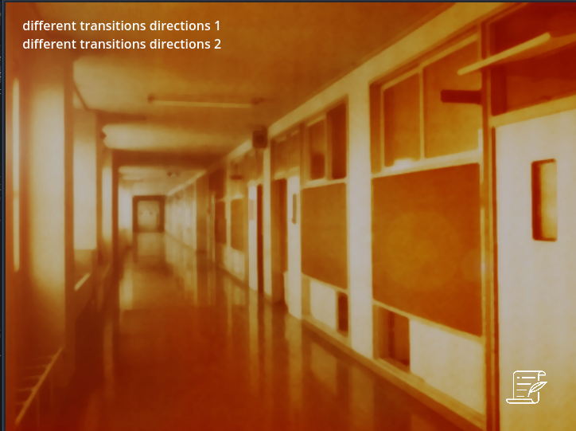

#### Overlay example

>[!NOTE]
>This example uses [Pixelated diamond directional fading transition](https://godotshaders.com/shader/pixelated-diamond-directional-fading-transition/) by [Joey Bland](https://godotshaders.com/author/joey_bland/) on [Godot Shaders](https://godotshaders.com/). The example folder includes a shader folder which contains this shader.

>[!NOTE]
>This uses the Background Handler created via the Adding backgrounds for the framework example!
>You can follow that section on how to add backgrounds for the framework.
>This also uses the Arcueid example from Adding characters to the framework!

This example showcases a custom shader for transitions!

```gdscript
extends DemoScripter_VisualNovelScene

@onready var background: DemoScripter_BackgroundHandler = $Background

func _ready() -> void:
	add_dialogue_start("background fourth example!")
	add_dialogue("this is for showcasing custom overlays")
	
	add_dialogue_next("testing red overlay")
	add_dialogue_special(background.add_overlay_normal, ["res://Demo-Scripter/docs/examples/shaders/saw_effect_shadermaterial.tres"])
	add_dialogue("this is a red flame thing overlay")
	add_dialogue("change background to 5")
	add_dialogue_special(background.change_background_transition, [5, "default", 3])
	add_dialogue("by default, the overlay does not get removed when the transition gets finished")
	add_dialogue("change background to 7 with remove active overlay")
	add_dialogue_special(background.change_background_transition, [7, "default", 3, {
		"remove_active_overlay": [0]
	}])
	add_dialogue("the overlay effect has been removed!")
	
	add_dialogue_next("rect blink test")
	add_dialogue("add overlay")
	add_dialogue_special(background.add_overlay_normal, ["res://Demo-Scripter/docs/examples/shaders/saw_effect_shadermaterial.tres"])
	add_dialogue("rect blink remove overlay on fadein test")
	add_dialogue_special(background.rect_blink, [1, 1, {
		"hold_middle": 2,
		"remove_active_overlay_fadein": [0]
	}])
	add_dialogue("add overlay again")
	add_dialogue_special(background.add_overlay_normal, ["res://Demo-Scripter/docs/examples/shaders/saw_effect_shadermaterial.tres"])
	add_dialogue("rect blink remove overlay on fadeout test")
	add_dialogue_special(background.rect_blink, [1, 1, {
		"hold_middle": 2,
		"remove_active_overlay_fadeout": [0]
	}])
	add_dialogue("while it worked as expected, it didnt remove the overlay during the white background part")
	add_dialogue("in this case, we will use active_overlay_visible key")
	
	add_dialogue_next("add overlay again again")
	add_dialogue_special(background.add_overlay_normal, ["res://Demo-Scripter/docs/examples/shaders/saw_effect_shadermaterial.tres"])
	add_dialogue("rect blink again")
	add_dialogue_special(background.rect_blink, [1, 1, {
		"hold_middle": 2,
		"active_overlay_visible_fadein": {0: false},
		"active_overlay_visible_fadeout": {0: true}
	}])
	add_dialogue("now, it worked fine!")
	
	add_dialogue_next("testing background effect")
	add_dialogue_special(background.change_background_effect, [10, "default", "res://Demo-Scripter/docs/examples/shaders/transition_shadermaterial.tres", "height", 1, -1, 3, 3])
	add_dialogue("ok...")
	add_dialogue("testing hold middle")
	add_dialogue_special(background.change_background_effect, [10, "default", "res://Demo-Scripter/docs/examples/shaders/transition_shadermaterial.tres", "height", 1, -1, 3, 3, {
		"hold_middle": 3
	}])
	add_dialogue("as you can see, the overlay still appeared in the middle!")
	add_dialogue("testing hold middle with overlay visible")
	add_dialogue_special(background.change_background_effect, [10, "default", "res://Demo-Scripter/docs/examples/shaders/transition_shadermaterial.tres", "height", 1, -1, 3, 3, {
		"hold_middle": 3,
		"active_overlay_visible_fadein": {0: false},
		"active_overlay_visible_fadeout": {0: false},
	}])
	
	add_dialogue("removed the overlay for the next test")
	add_dialogue_special(background.remove_overlay_normal_id_instant, [0])
	
	add_dialogue_next("now testing overlay persistant")
	add_dialogue_special(background.add_overlay_persistant, ["res://Demo-Scripter/docs/examples/shaders/saw_effect_shadermaterial.tres"])
	add_dialogue("change background transition with overlay persistant")
	add_dialogue_special(background.change_background_transition, [2, "default", 3])
	add_dialogue("change background effect with overlay persistant")
	add_dialogue_special(background.change_background_effect, [20, "default", "res://Demo-Scripter/docs/examples/shaders/transition_shadermaterial.tres", "height", 1, -1, 3, 3])
	add_dialogue("the overlay persistant gets on top of the transition effect!")
	add_dialogue("lastly, removing overlay persistant")
	add_dialogue_special(background.remove_overlay_normal_id_instant, [0])
	
	load_dialogue_start()

```

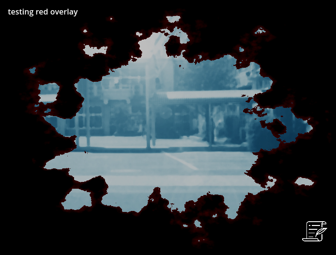
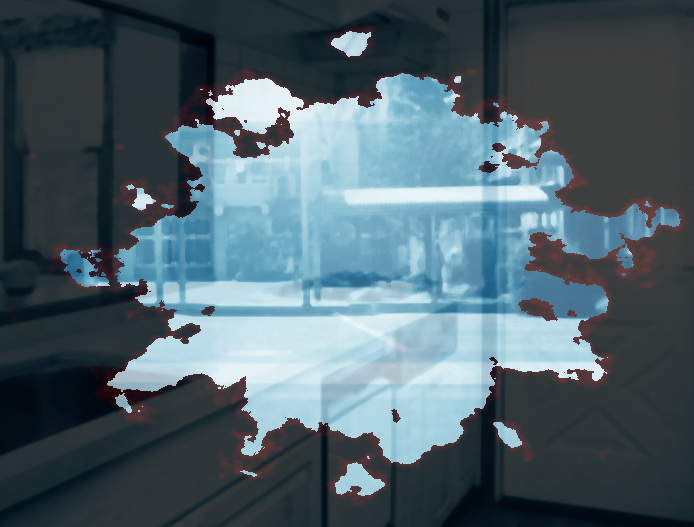
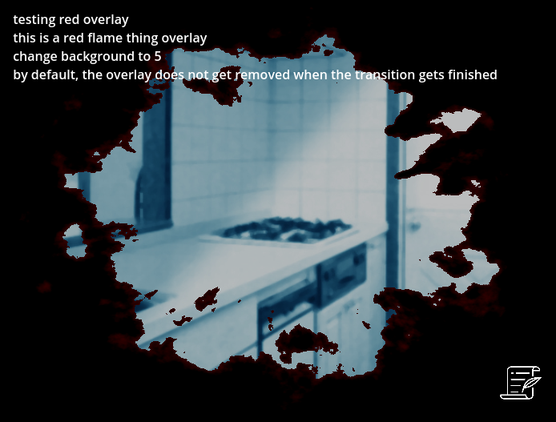

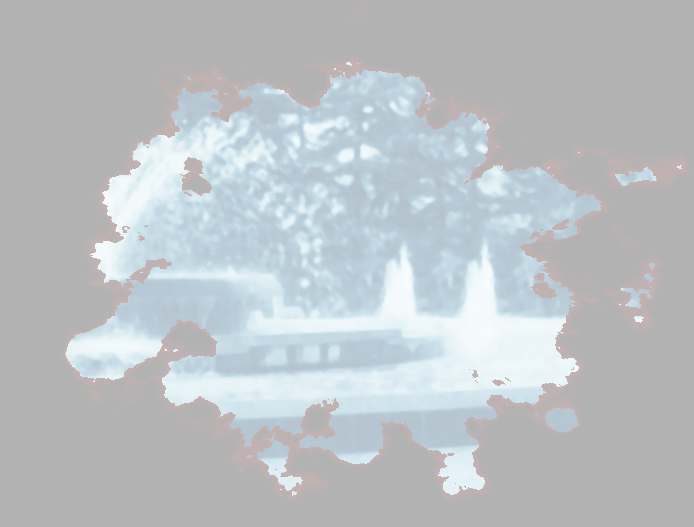
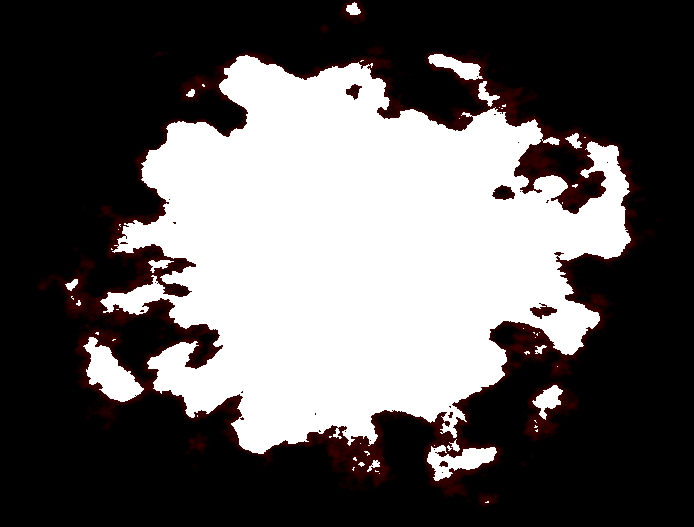
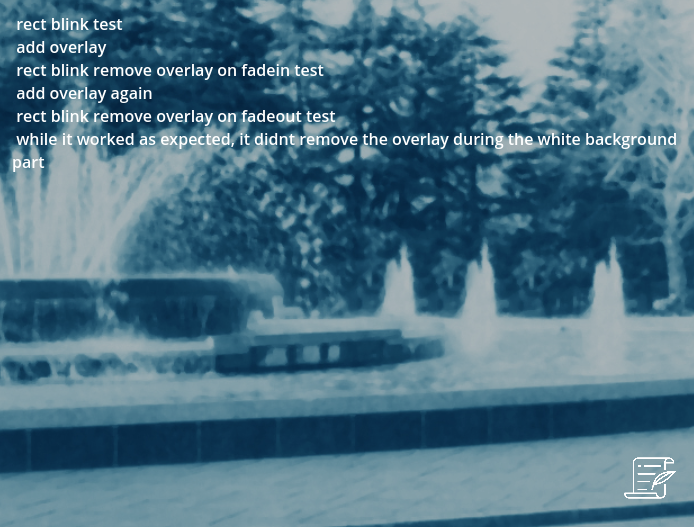

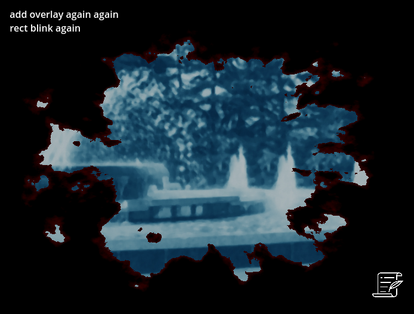
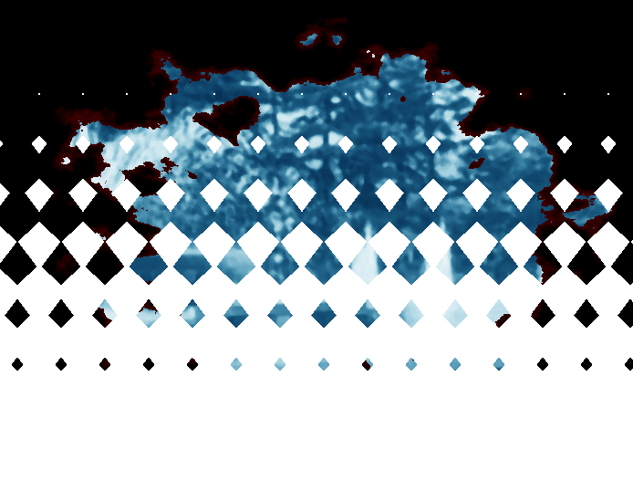
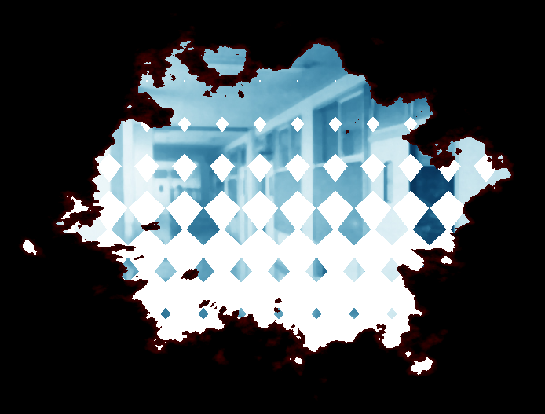
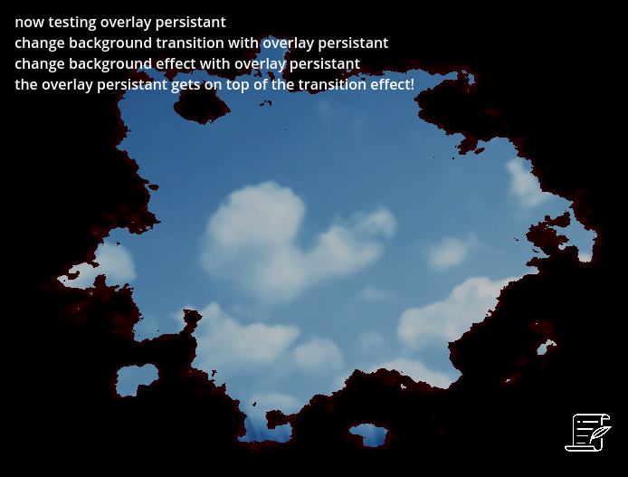

## Multiple Sets

>[!NOTE] 
>Sets are like different groups of dialogue.
>By default, "start" is the main set of the dialogue.
>Sets can go to different sets, for example, you can use a button handler which shows different options that goes to a different set!
>Like "start" > "choice1" or "start" > "choice2".

To add a different set other than start by default, you specify the second argument in add_dialogue_start. By default, the value of second argument is "start".

```gdscript
add_dialogue_start("Dialogue test", "NAME OF SET")
```

For example:

This script has three sets: "start", "middle" and "end".

```gdscript
add_dialogue_start("first dialogue of start")
add_dialogue("second dialogue of start")
add_dialogue("third dialogue of start")

add_dialogue_start("first dialogue of middle")
add_dialogue("second dialogue of middle")
add_dialogue("second dialogue of middle")


add_dialogue_start("first dialogue of end")
add_dialogue("second dialogue of end")
add_dialogue("second dialogue of end")
```

Keep in mind that "start", once finished, cannot reach "middle" and "middle" cannot reach "end".

The reason why is because there is nothing allowing any of theses dialogues sets to go to another. (like buttons, auto condition, etc)

### Simple Goto Buttons

This example uses DemoScripter_ButtonHandler, a module for creating buttons to be used alongside DemoScripter. It's a way to deal with choices in a Visual Novel scene!

In the story script example, it has some extra information about DemoScripter from me!

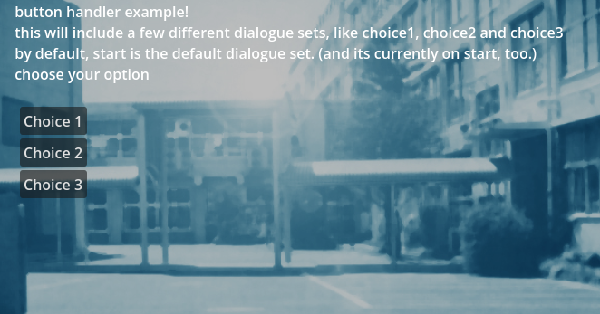

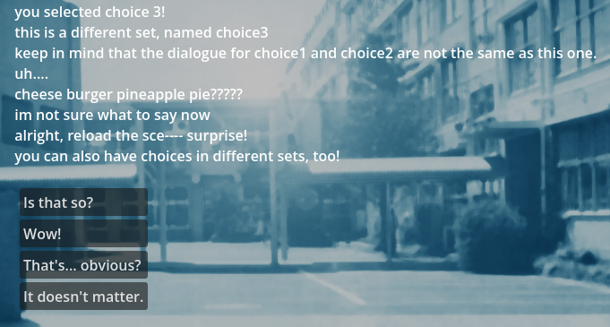

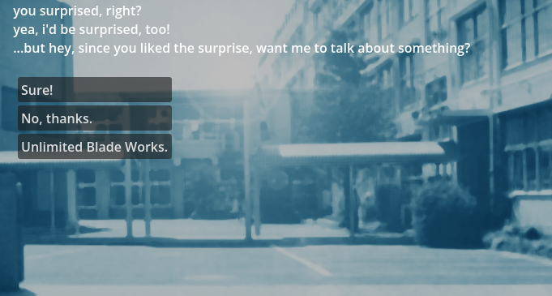

Before running this script, add DemoScripter_ButtonHandler in your HUD node. (which in this case it's named Text but feel free to name it anything you like. Keep in mind to update the DemoScripter_ButtonHandler export variable from this script to correctly point to the DemoScripter_ButtonHandler node)

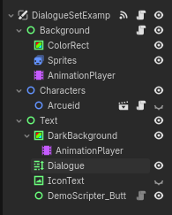

>[!note]
>When creating the buttons, don't use add_dialogue_special! Just use buttons.create_button_goto_set.
>If you use add_dialogue_special, it prevents you to get the button using buttons.get_button()! (which prevents to connect pressed signal)

```gdscript
extends DemoScripter_VisualNovelScene

@onready var background: DemoScripter_BackgroundHandler = $Background
@onready var buttons: DemoScripter_ButtonHandler = $Text/DemoScripter_ButtonHandler

func _ready() -> void:
	add_dialogue_start("button handler example!")
	add_dialogue("this will include a few different dialogue sets, like choice1, choice2 and choice3")
	add_dialogue("by default, start is the default dialogue set. (and its currently on start, too.)")
	add_dialogue("choose your option")
	buttons.create_button_goto_set("Choice 1", "choice1", "choices")
	buttons.create_button_goto_set("Choice 2", "choice2")
	buttons.create_button_goto_set("Choice 3", "choice3")
	add_dialogue_special(buttons.button_set_appear, ["choices"])
	
	add_dialogue_start("you selected choice 1!", "choice1")
	add_dialogue("this is a different set, named choice1!")
	add_dialogue("keep in mind that the dialogue for choice2 and choice3 are not the same as this one.")
	add_dialogue("cool...")
	add_dialogue("now, reload the scene manually")
	
	add_dialogue_start("you selected choice 2!", "choice2")
	add_dialogue("this is a different set, named choice2!")
	add_dialogue("keep in mind that the dialogue for choice1 and choice3 are not the same as this one.")
	add_dialogue("tsukihime 2 will be released tomorrow")
	add_dialogue("hopefully...")
	add_dialogue("............please....")
	add_dialogue("anyways, reload the scene manually")
	
	add_dialogue_start("you selected choice 3!", "choice3")
	add_dialogue("this is a different set, named choice3")
	add_dialogue("keep in mind that the dialogue for choice1 and choice2 are not the same as this one.")
	add_dialogue("uh....")
	add_dialogue("cheese burger pineapple pie?????")
	add_dialogue("im not sure what to say now")
	add_dialogue("alright, reload the sce---- surprise!")
	add_dialogue("you can also have choices in different sets, too!")
	buttons.create_button_goto_set("Is that so?", "extra1", "extras")
	buttons.create_button_goto_set("Wow!", "extra2", "extras")
	buttons.create_button_goto_set("That's... obvious?", "extra3", "extras")
	buttons.create_button_goto_set("It doesn't matter.", "extra4", "extras")
	add_dialogue_special(buttons.button_set_appear, ["extras"])
	
	add_dialogue_start("yep!", "extra1")
	add_dialogue_continue("it's something very cool, right?")
	add_dialogue("it does allow you to make some complex branching depending on choices!")
	add_dialogue("but, that's about it for this set!")
	add_dialogue("reset the scene manually")
	
	add_dialogue_start("you surprised, right?", "extra2")
	add_dialogue("yea, i'd be surprised, too!")
	add_dialogue("...but hey, since you liked the surprise, want me to talk about something?")
	buttons.create_button_goto_set("Sure!", "end1", "end")
	buttons.create_button_goto_set("No, thanks.", "end2", "end")
	buttons.create_button_goto_set("Unlimited Blade Works.", "end3", "end")
	add_dialogue_special(buttons.button_set_appear, ["end"])
	
	add_dialogue_start("alright, then!", "end1")
	add_dialogue("i'll tell you about something!")
	add_dialogue("it's for a visual novel that i'm currently making for DemoScripter!")
	add_dialogue("the name is ■■■■'■ ■■■■■■■■■")
	add_dialogue("...wow, i did not get it at all")
	add_dialogue("that's what you're thinking, right?")
	add_dialogue("well, it's currently private for now")
	add_dialogue("to be more precise, it's a private alpha that only people who get invited can access")
	
	add_dialogue_next("i apologize for not publicly saying the name of the project")
	add_dialogue("but one of the reasons that i dont want to public announce it yet is to prevent early exceptations and stress")
	add_dialogue("you might think that i'm exaggerating that people will already be fans of the visual novel")
	add_dialogue("but well, it's not a visual novel from a original IP.")
	add_dialogue("which means, it's a fanfiction!")
	add_dialogue("and well, i hate how currently DemoScripter is.")
	add_dialogue("only after I started working on the project with a scale of 10 chapters per route (5 routes), i realized how time consuming just using DemoScripter is right now.")
	add_dialogue("the project also uses CSV for translations for portuguese (br) and english and boy, it did show how flawed this current design is")
	add_dialogue("and i cant really blame myself much, the foundations of DemoScripter is from september 2023, where I was still learning Godot Engine in January 2023.")
	add_dialogue("once the public alpha chapter 1 of the visual novel project is released, I will take a week break, see how people thought of the visual novel, study software architecture and Refactoring.Guru to refactor DemoScripter for v1.0.0")
	
	add_dialogue_next("and damn, im not really sure how would i deal in case theres like, tons of fans and people interested to help me on the visual novel during this refactor phase")
	add_dialogue("its also my first time ever doing something like this, so i'd like help on how can i manage it in the future, like how to handle the project while refactoring DemoScripter, etc")
	add_dialogue("by the way, sorry for the long talk")
	add_dialogue("it was meant to show a example using buttons, right?")
	add_dialogue("yeah, it got way out of the original path")
	add_dialogue("but anyways, that's about it")
	add_dialogue("and in case you do know how i can handle a project like that, please contact me")
	add_dialogue("so now, reset the scene manually")
	
	add_dialogue_start("you really don't want to?", "end2")
	add_dialogue("thats a shame then")
	add_dialogue("if a person refuses, that means the person refused")
	add_dialogue("...sorry, i just think tautologies are funny")
	add_dialogue("anyways, reset the scene manually")
	
	add_dialogue_start("I am the bone of my sword.", "end3")
	add_dialogue("Steel is my body and fire is my blood.")
	add_dialogue("I have created over a thousand blades.")
	add_dialogue("Unknown to Death,")
	add_dialogue("Nor known to Life.")
	add_dialogue("Have withstood pain to create many weapons.")
	add_dialogue("Yet, those hands will never hold anything.")
	add_dialogue("So as I pray...")
	add_dialogue("\n\n\n[center]---Unlimited Blade Works[/center]")
	
	add_dialogue_start("yeah, that's something you'd expect by now", "extra3")
	add_dialogue("sorry, i thought you'd be surprised")
	add_dialogue("but since that didn't surprise you, it means you're a smart person!")
	add_dialogue("now, thats about it for this set")
	add_dialogue("reset the scene manually")
	
	add_dialogue_start("It doesn't matter.", "extra4")
	for k in 125:
		add_dialogue_continue("It doesn't matter.")
	
	load_dialogue_start()
```

- create_button_goto_set - creates a button that goes to a different set.
- - First argument: The name of the button
- - Second argument: What dialogue it will goto once clicked
- - Third argument: The set of where this button belongs.
- - - A button set is the list of buttons that will be displayed when button_set_appear is executed. If the third argument is not specified, it uses the last time the third argument was executed to create set by default. The same goes to button_set_appear, too.
- button_set_appear - makes a set of button appears.
- - First argument: The name of the button set. If not specified, uses the last time third argument was specified in create_button_goto_set

### Conditional Buttons

>[!NOTE]
>Check Simple Goto buttons section for setting up DemoScripteR_ButtonHandler on your visual novel scene

This is a example using DemoScripter_ButtonHandler for conditional buttons. You can also refer this as conditional choices, too.

This also contains a example of end_dialogue, where you can go to a different set once a dialogue set is finished! (includes conditional, too)

Also includes a export variable named can_choice3_show where an third choice only appears if this variable is true.

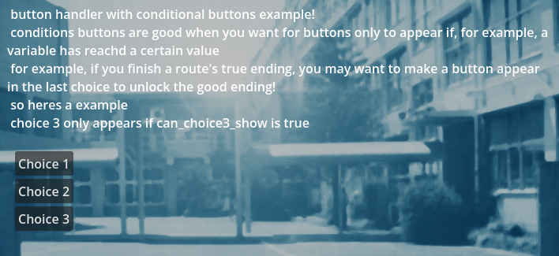
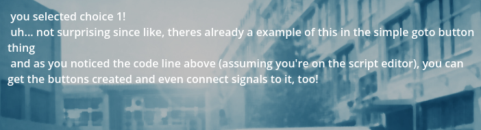
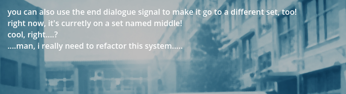
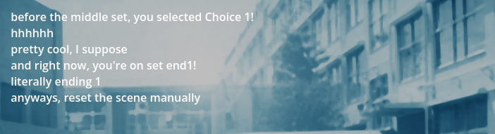

```gdscript
extends DemoScripter_VisualNovelScene

@onready var background: DemoScripter_BackgroundHandler = $Background
@onready var buttons: DemoScripter_ButtonHandler = $Text/DemoScripter_ButtonHandler

@export var can_choice3_show: bool

var choice1_pressed: bool
var choice2_pressed: bool
var choice3_pressed: bool

func _ready() -> void:
	add_dialogue_start("button handler with conditional buttons example!")
	add_dialogue("conditions buttons are good when you want for buttons only to appear if, for example, a variable has reachd a certain value")
	add_dialogue("for example, if you finish a route's true ending, you may want to make a button appear in the last choice to unlock the good ending!")
	add_dialogue("so heres a example")
	add_dialogue("choice 3 only appears if can_choice3_show is true")
	buttons.create_button_goto_set("Choice 1", "choice1", "choices")
	buttons.create_button_goto_set("Choice 2", "choice2")
	buttons.create_button_goto_set_condition("Choice 3", 
		func():
			return can_choice3_show, 
		"choice3")
	add_dialogue_special(buttons.button_set_appear)
	
	buttons.get_button("Choice 1", "choices").pressed.connect(func(): choice1_pressed = true)
	buttons.get_button("Choice 2", "choices").pressed.connect(func(): choice2_pressed = true)
	buttons.get_button("Choice 3", "choices").pressed.connect(func(): choice3_pressed = true)
	
	add_dialogue_start("you selected choice 1!", "choice1")
	add_dialogue("uh... not surprising since like, theres already a example of this in the simple goto button thing")
	add_dialogue("and as you noticed the code line above (assuming you're on the script editor), you can get the buttons created and even connect signals to it, too!")
	add_dialogue("sigh.... i really hope to refactor this so its possible to do it via the addon menu.....")
	
	add_dialogue_start("you selected choice 2!", "choice2")
	add_dialogue("yeah uhh, you selected choice 2")
	add_dialogue("not sure what else to say")
	
	add_dialogue_start("you selected the secret choice 3!", "choice3")
	add_dialogue("which is only possible if you set can_choice3_appear to true!")
	add_dialogue("its useful if you want certain buttons to appear only if a condition is true, like meeting a character before, etc")
	add_dialogue("moving on...")
	
	add_dialogue_start("you can also use the end dialogue signal to make it go to a different set, too!", "middle")
	add_dialogue("right now, it's curretly on a set named middle!")
	add_dialogue("cool, right....?")
	add_dialogue("....man, i really need to refactor this system.....")
	
	add_dialogue_next("anyways")
	add_dialogue("you can also use the conditional function to alter variables, too!")
	add_dialogue("keep in mind that you're still on middle dialogue set")
	add_dialogue("this is just the second page")
	
	add_dialogue_start("before the middle set, you selected Choice 1!", "end1")
	add_dialogue("hhhhhh")
	add_dialogue("pretty cool, I suppose")
	add_dialogue("and right now, you're on set end1!")
	add_dialogue("literally ending 1")
	add_dialogue("anyways, reset the scene manually")
	
	add_dialogue_start("before the middle set, you selected Choice 2!", "end2")
	add_dialogue("uh")
	add_dialogue("btw, you're on set end2!")
	add_dialogue("literally ending 2")
	add_dialogue("probably could refer ending 1 as normal and ending 2 as good ending???")
	add_dialogue("not sure")
	add_dialogue("anyways, reset the scene manually")
	
	add_dialogue_start("before the middle set, you selected the secret Choice 3!", "end3")
	add_dialogue("well, the reason why i refered to it as secret is because it only shows if you set the can_choice3_show to true")
	add_dialogue("nice, i guess...????")
	add_dialogue("you could refer this as the secret ending!")
	add_dialogue("or uh, alternative ending that appears once you finish a route or something idk")
	
	
	load_dialogue_start()


func _on_end_dialogue_signal() -> void:
	match dialogue_current_set:
		"choice1":
			load_dialogue_start(1, "middle", false, true, true)
		"choice2":
			load_dialogue_start(1, "middle", false, true, true)
		"choice3":
			load_dialogue_start(1, "middle", false, true, true)
		"middle":
			if choice1_pressed:
				load_dialogue_start(1, "end1", false, true, true)
			
			if choice2_pressed:
				load_dialogue_start(1, "end2", false, true, true)
			
			if choice3_pressed:
				load_dialogue_start(1, "end3", false, true, true)
		_:
			end_dialogue()
```

- buttons.create_button_goto_set_condition() - creates a goto set button that only shows up if the lambda function of second argument returns true
- - First argument: name of the button
- - Second argument: the lambda function
- - Third argument: the dialogue set the button goes to
- buttons.get_button() - returns the button node.
- - First argument: name of the button
- - by using this function, you can connect signals to the button, like pressed! (and use lambda functions, too)
- - - buttons.get_button("Choice 1", "choices").pressed.connect(func(): choice1_pressed = true)

### Custom Button Functions

This example uses DemoScripter_ButtonHandler, showcasing custom button functionality when pressed.

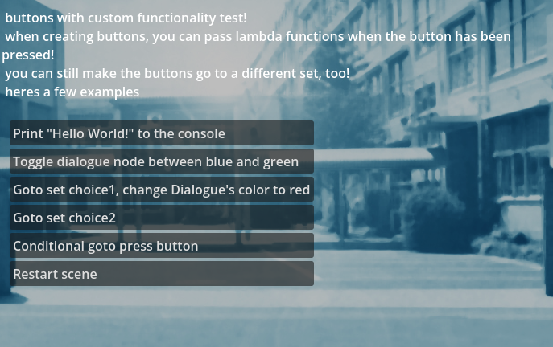
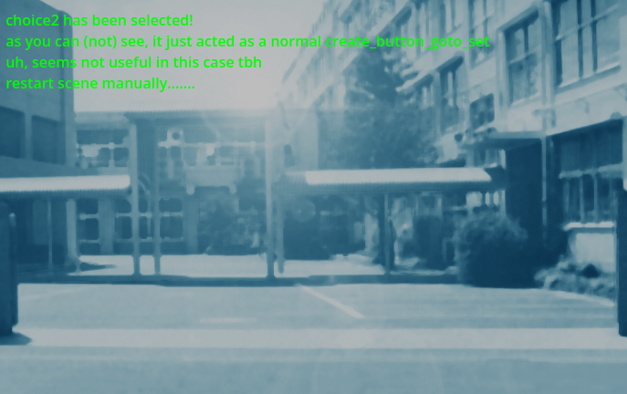

```gdscript
extends DemoScripter_VisualNovelScene

@onready var background: DemoScripter_BackgroundHandler = $Background
@onready var buttons: DemoScripter_ButtonHandler = $Text/DemoScripter_ButtonHandler

@export var conditional_goto_press: bool

var toggle_choice2: bool

func _ready() -> void:
	add_dialogue_start("buttons with custom functionality test!")
	add_dialogue("when creating buttons, you can pass lambda functions when the button has been pressed!")
	add_dialogue("you can still make the buttons go to a different set, too!")
	add_dialogue("heres a few examples")
	buttons.create_button("Print \"Hello World!\" to the console", func():
		print("Hello World!")
	, "group1")
	buttons.create_button("Toggle dialogue node between blue and green", func():
		if not toggle_choice2:
			dialogue_node.set_modulate(Color.BLUE)
		else:
			dialogue_node.set_modulate(Color.GREEN)
		
		toggle_choice2 = !toggle_choice2 
	)
	buttons.create_button("Goto set choice1, change Dialogue's color to red", func():
		buttons.goto_set("choice1", "group1")
		dialogue_node.set_modulate(Color.RED)
	)
	buttons.create_button("Goto set choice2", func():
		buttons.goto_set("choice2", "group1")
	)
	buttons.create_button("Conditional goto press button", func():
		if conditional_goto_press:
			buttons.goto_set("conditional1", "group1")
		else:
			buttons.goto_set("conditional2", "group1")
	)
	buttons.create_button("Restart scene", func():
		get_tree().reload_current_scene())
	add_dialogue_special(buttons.button_set_appear)
	
	add_dialogue_start("choice1 has been selected!", "choice1")
	add_dialogue("as you can see, the dialogue's node color has been changed to red!")
	add_dialogue("uh, cool i suppose")
	add_dialogue("reload the scene manually................")
	
	add_dialogue_start("choice2 has been selected!", "choice2")
	add_dialogue("as you can (not) see, it just acted as a normal create_button_goto_set")
	add_dialogue("uh, seems not useful in this case tbh")
	add_dialogue("restart scene manually.......")
	
	add_dialogue_start("you selected condition1 set!", "conditional1")
	add_dialogue("the reason why it's condition1 is because conditional_goto_press was set to true!")
	add_dialogue("this allows you to create buttons that can go to multiple sets depending on conditions")
	add_dialogue("yeah, cool!")
	add_dialogue("i suppose")
	add_dialogue("hmm...")
	add_dialogue("did you know dante from devil may cry series will appear in yumizuka route in tsukihime remake?")
	add_dialogue("how to i know about that, you may be asking?")
	add_dialogue("it was stated in cyfow")
	add_dialogue("trust")
	add_dialogue("anyways, reload scene manually")
	
	add_dialogue_start("you selected condition2 set!", "conditional2")
	add_dialogue("the reason why it's condition2 is because conditional_goto_press was set to false!")
	add_dialogue("hmm.........")
	add_dialogue("alright, i'm not really sure what else to day, tbh")
	add_dialogue("scene reload manual")
	
	load_dialogue_start()


func _on_end_dialogue_signal() -> void:
	end_dialogue()
```

- buttons.create_button()
- - First argument: name of the button
- - Second argument: the lambda function for the button

# Adding backgrounds for the framework

>[!NOTE]
>The following background images are from Tsukihime. Tsukihime is owned by TYPE-MOON. This is only for example purposes.
>I extracted the Tsukihime's character sprites using [ONScripter-EN's](https://github.com/Galladite27/ONScripter-EN) tools maintained by [Galladite27](https://galladite.net/~galladite/). (extracting the ONScripter source code, running ./configure on terminal and running make tools on terminal.)
>If you'd like support on how to use ONScripter-EN and it's tools, feel free to ask for help on [ONScripter-EN's discord server](https://github.com/Galladite27/ONScripter-EN)!
>You can also filter the discord server messages via the search bar and see my first messages, which shows me asking for help on how to extract sprites.

## Tsukihime backgrounds example

>[!NOTE]
>The example below uses a project resolution of 720x540.

First, instantiate background handler from demoscripter folder to your visual novel scene.
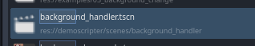

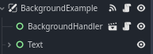

Rename the BackgroundHandler to Background.

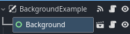

Make the Background node (previuosly named BackgroundHandler) to local. This is for adding the background sprites and not altering the background handler from demoscripter folder.

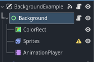

Create a new SpriteFrame on Sprites and add the Tsukihime backgrounds from assets/backgrounds of this documentation folder.

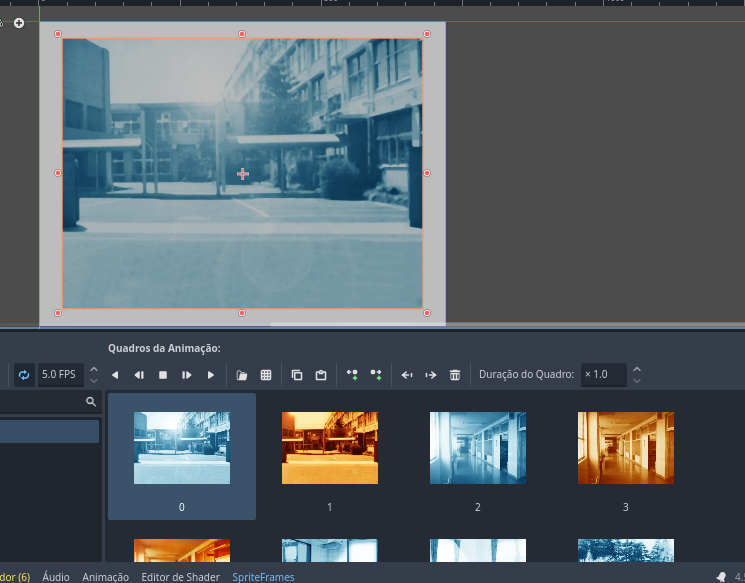

As you can see, the sprite resolution inst in the correct size due to the project being in 720x540.

On Sprites node, set the Scale size to x: 1.125 and y: 1.125
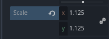

After changing the scale, create a Node2D on your scene named Characters.

>[!NOTE]
>Even if you're not going to use characters, this is for preventing the assert function of empty characters node from returng true, causing an error.

On Background node, set the Main Scene variable to the root node (or the node that the background handler is inside, which is a DemoScripter_VisualNovelScene node)

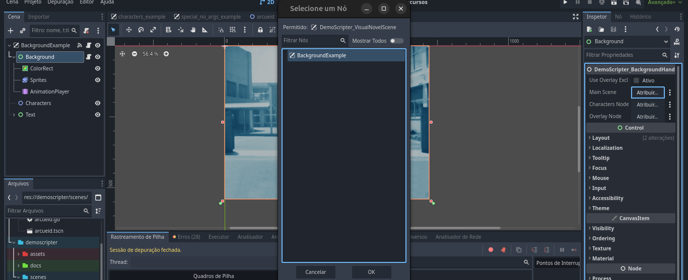

Then set the Characters Node to the Node2D named Characters you just created.

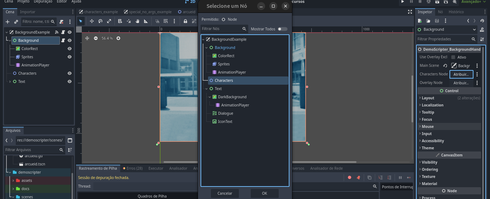

The overlay node can be empty because it's optional and only meant to be used if Use Overlay Exclusive Node is enabled, which handles overlays on a seperate node.

And done! You should have a background handler ready to use!

# Creating characters using the framework

>[!NOTE]
>The following characters are from Tsukihime. Tsukihime is owned by TYPE-MOON. This is only for example purposes.

>[!NOTE]
>I extracted the Tsukihime's character sprites using [ONScripter-EN's](https://github.com/Galladite27/ONScripter-EN) tools maintained by [Galladite27](https://galladite.net/~galladite/). (extracting the ONScripter source code, running ./configure on terminal and running make tools on terminal.)
>After making the extractions, I used my [NScripter Sprite Extractor](https://github.com/Lukaswbrr/nscripter-sprite-extractor-script) script made for Krita to make the sprites transparent.
>If you'd like support on how to use ONScripter-EN and it's tools, feel free to ask for help on [ONScripter-EN's discord server](https://github.com/Galladite27/ONScripter-EN)!
>You can also filter the discord server messages via the search bar and see my first messages, which shows me asking for help on how to extract sprites.

To create characters to be used with the framework, you use the DemoScripter_VisualNovelCharacter class.

The character must have the following nodes:

- AnimatedSprites for the characters sprites
- AnimationPlayer for show and hide animations (can also be custom animations)
- AnimationPlayer named EmotionPlayer for the characters's emotions

There is a base character scene in scenes/character_base/CharacterBase.tscn.

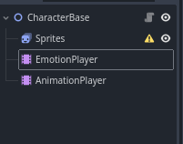

## Arcueid Example

>[!IMPORTANT]
>The example below uses a project resolution of 720x540.

This a step-by-step example on making a character using the CharacterBase scene file as reference. The following character is from Tsukihime (2000). The complete example can be accessed
in examples/characters folder.

### Create characters folder

In your godot project, create a folder that will be used to store your characters.
It can be any folder name. In this example, it's just called characters.

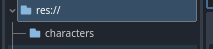

### Create arcueid folder

Create the folder to store arcueid's sprites, files, etc.

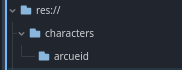

### Duplicate character base to arcueid folder

On character_base folder from DemoScripter, duplicate CharacterBase.tscn file and name it arcueid.tscn

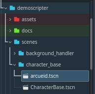

Move the arcueid.tscn to arcueid folder located in characters

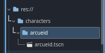

For safety purposes, in case AnimationPlayer gets somehow modified in the base despite only modifying on Arcueid's scene file, go to EmotionPlayer, click on Manage Animations and on \[global], click on Save Icon and click on Turn Unique.

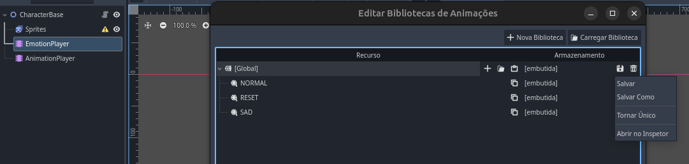

Do the same to the AnimationPlayer node.

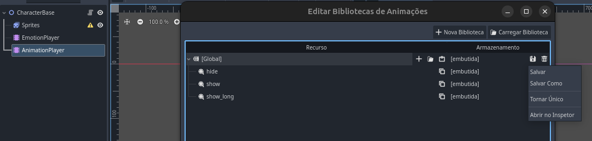

### Rename Arcueid scene's CharacterBase nose to Arcueid

Change the main node's name to Arcueid.

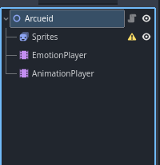

### Create assets folder in arcueid folder

In arcueid's folder, create a folder named assets.

This is where the sprites images will be located.

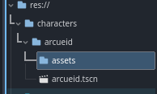

### Add sprites to assets folder

In the docs/assets/characters/arcueid folder, copy all of the sprites to the arcueid's assets folder.

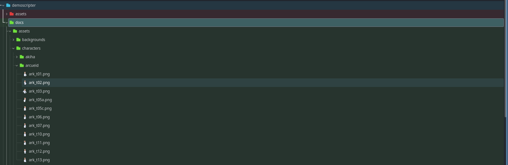

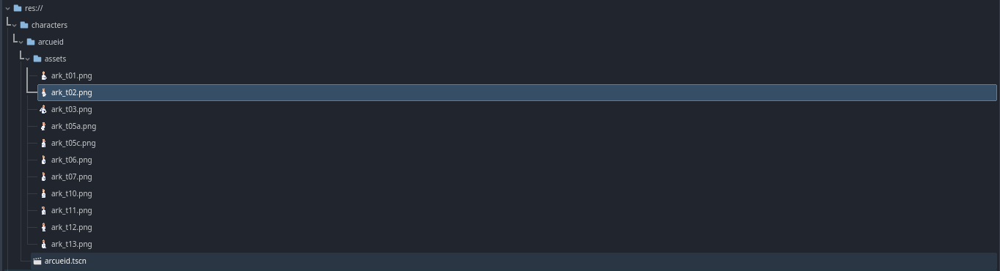

### Create SpriteFrames on AnimatedSprites node

On AnimatedSprites node, create a new SpriteFrames.

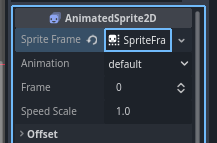

### Rename default group to normal

>[!NOTE]
>This is not really necessary and if you want, you can use the default group name. The reason why I ask to rename this to normal is because the EmotionPlayer emotions example (NORMAL, SAD, RESET) sets the AnimatedSprites's group propriety to normal. You can change this in the EmotionPlayer's to default group before using a group name named default on AnimatedSprites node.

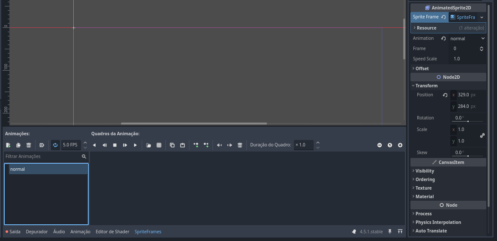

### Add Arcueid's sprites from the assets folder of the character to normal group of SpriteFrames

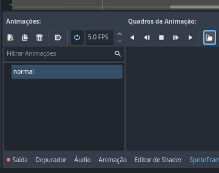

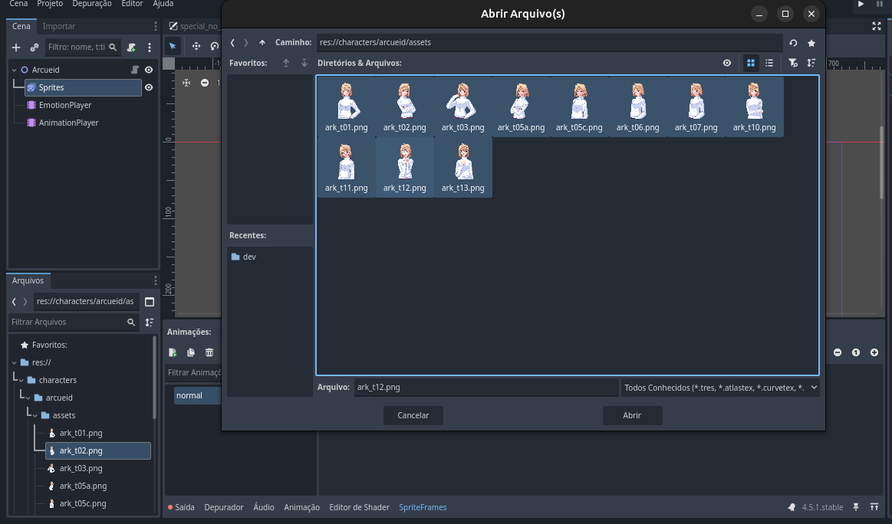

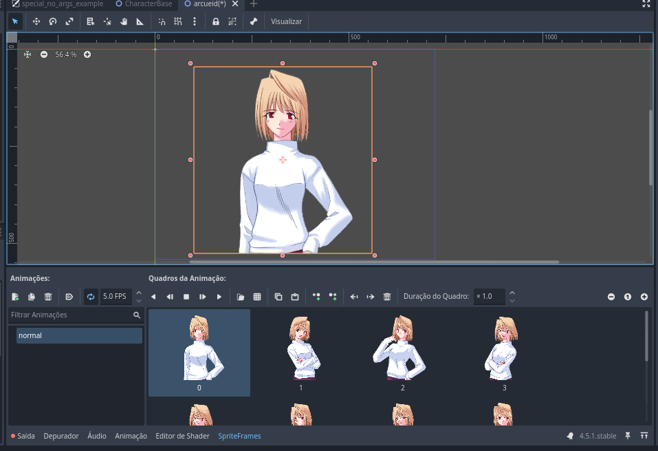

### Move AnimatedSprites's position

When added the arcueid's sprites, the position of the AnimatedSprites looks off and not fully to the ground.

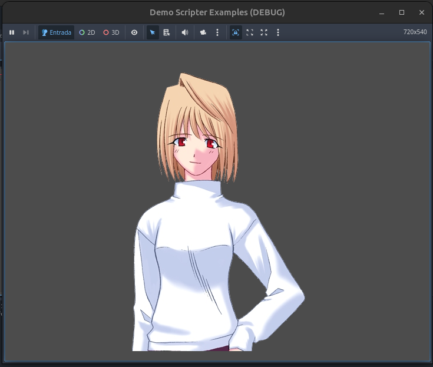

To fix this, on the x position, type 720/2 which will divide 720 by 2, resulting in 360. (720 is the project's width value.)

Using the move tool, hold shift and try to move it down where it overlaps with the project's resolution boundaries.

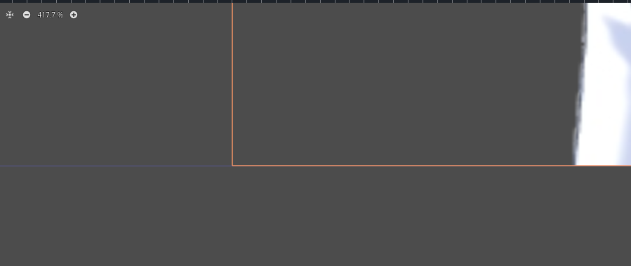

The final value will be:

- x: 360
- y: 300

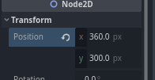

### Resize AnimatedSprites

Right now, Arcueid's sprite seems too small.

Click on the AnimatedPlayer nodes with the select mode, hold shift and resize Arcueid's top left point until it overlaps with the project's resolution.

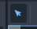

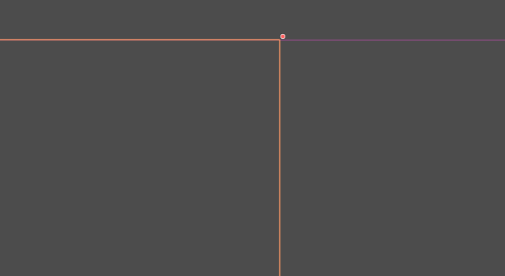

When you resize the sprite, it will look offset again from the center.
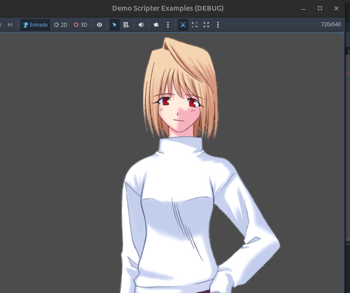

In the position propriety of AnimatedSprites node, change the position to the following:

- x: 360
- y: 270

It will be on center again.

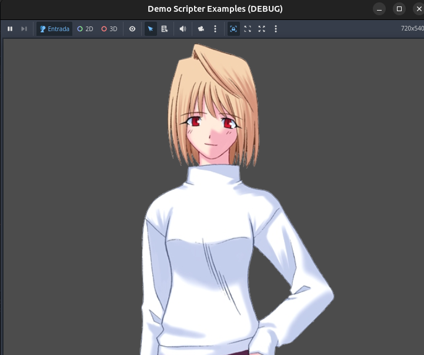

### Fix incorrect SAD emotion

By default, the SAD emotion sets the frame of the AnimatedSprites to 1.

In arcueid's case, this is the wrong sprite for the emotion.

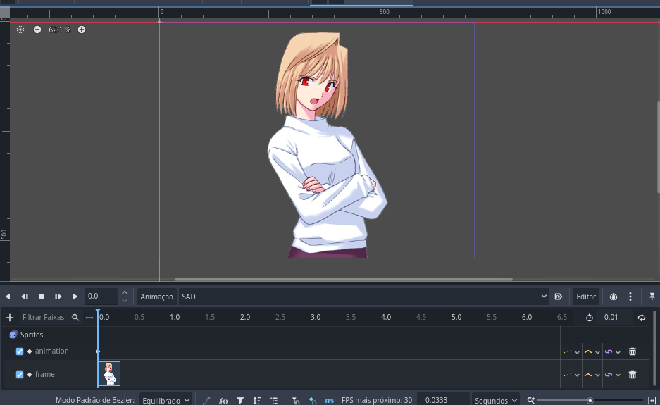

The fix will change the frame to 7, which will change to sprite 7 from AnimatedSprites.

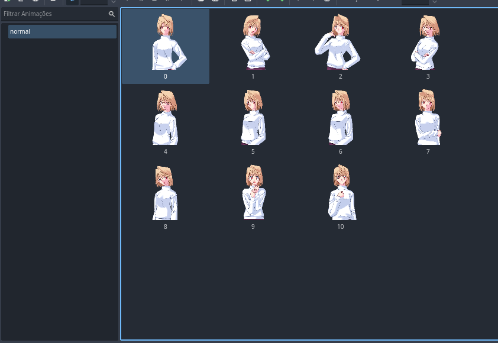

>[!NOTE]
>In case your 7 frame is different from this screenshot, change the value to where the sprite image from 7 in the screenshot is.

In the EmotionPlayer, select the SAD animation and click on the image from frame property.

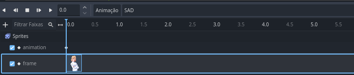

In the right side (or where your inspector's properties screen is located on), change the value to 7.

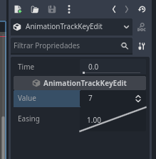

Now the SAD emotion should have the right sprite.

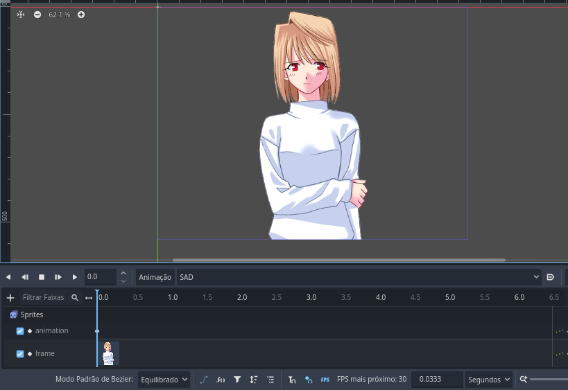

>[!NOTE]
>You may need to change the emotion from the EmotionPlayer to NORMAL then to SAD to see the difference

### Create new emotions

To create new emotions, I recommend duplicating a already existing emotion, in this case, NORMAL.

The animations from EmotionPlayer runs for 0.01 seconds, which is only meant for a easy way to create emotions for characters. Duplicating a existant emotion already sets the animation time to 0.01.

>[!NOTE] In case your new character emotion is not being updated, despite changing the frame property value, verify if you accidentally moved the frame property. This could change the emotion not to change.
>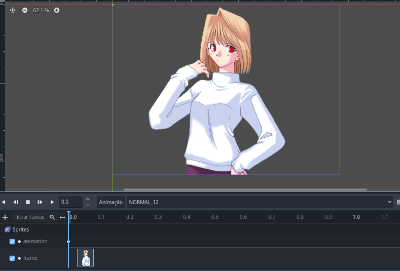

We will create the new emotions named:

- NORMAL_2
- NORMAL_3
- ANGRY
- ANGRY_2
- DOUBT
- DOUBT_2
- SAD_2
- SURPRISED
- SURPRISED_2

First, select NORMAL emotion, then click on duplicate.

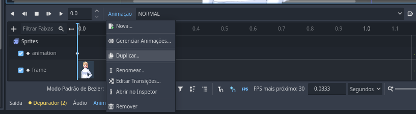

By default, the name should be NORMAL_2:
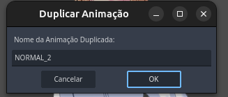

Change the NORMAL_2's frame property value to 1.

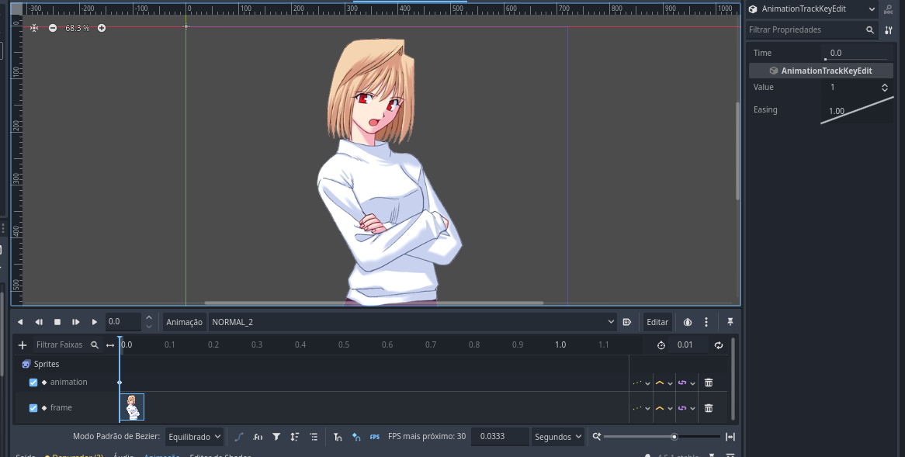

Repeat the same process with the following values of each emotion name:

- NORMAL_3: 2
- ANGRY: 3
- ANGRY_2: 4
- DOUBT: 5
- DOUBT_2: 6
- SAD_2: 8
- SURPRISED: 9
- SURPRISED_2: 10

Your EmotionPlayer's animation list should be like this.

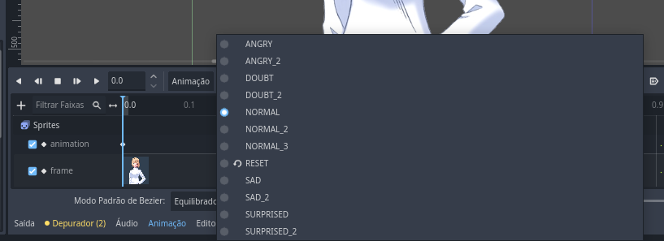

### Set position left and right values

When you select the Arcueid node, you can notice that DemoScripter_VisualNovelCharacter has three export variables:

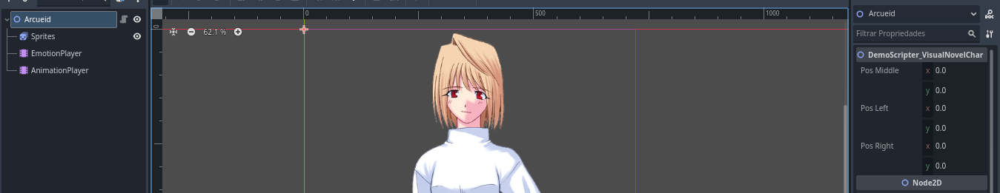

- Pos Middle
- Pos Left
- Pos Right

This is for setting the character's position when setpos_character function is executed on DemoScripter_VisualNovelScene.

Keep in mind, this is for setting the character's node named Arcueid and not the Sprites!

Since arcueid's position is already on the middle (0, 0), Pos middle will remain the same. (0, 0)

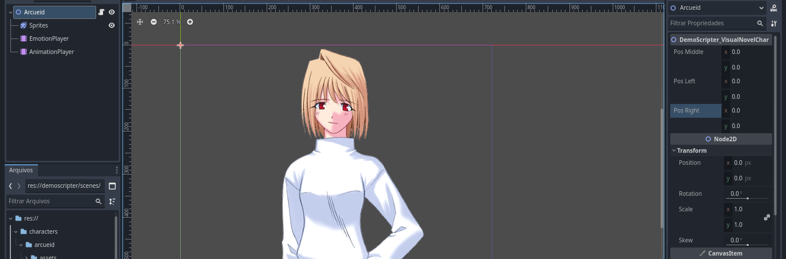

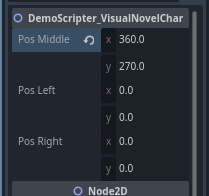

After that, select the Arcueid node and while holding shift, move it to the left.

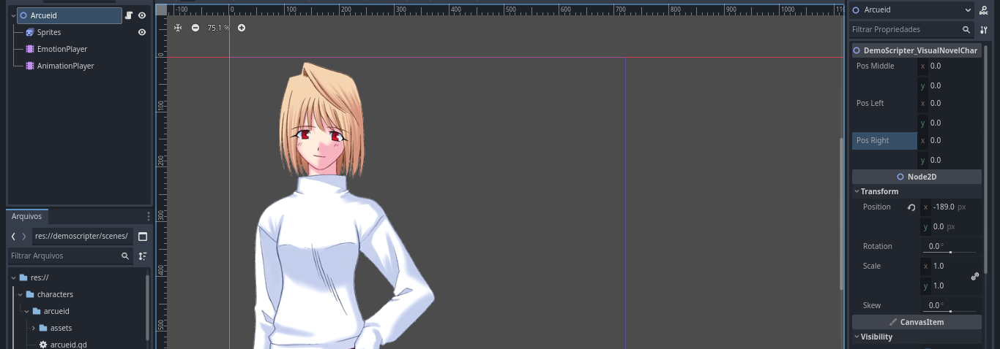

Copy the value from position and paste it to Pos Left.

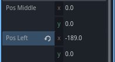

In this case, the position X is -189.

Then, copy the value from Pos Left to Pos Right and remove the minus sign of the x value. (-189, which will turn into 189)

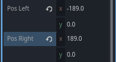

Copy the Pos Middle value to Arcueid's position property to center Arcueid by default again.
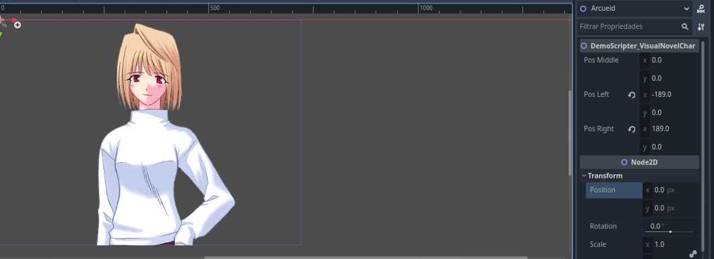

### Create arcueid script

Right click on Arcueid's node and click on Extend script.

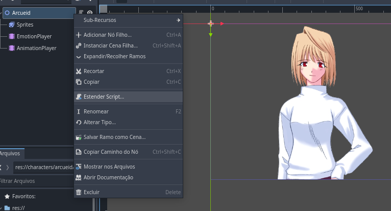

Save it on arcueid's character folder.

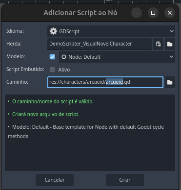

### Auto add emotions function

On arcueid.gd, in the _ready function, add auto_add_emotions() function. This is for loading the emotions for the character.

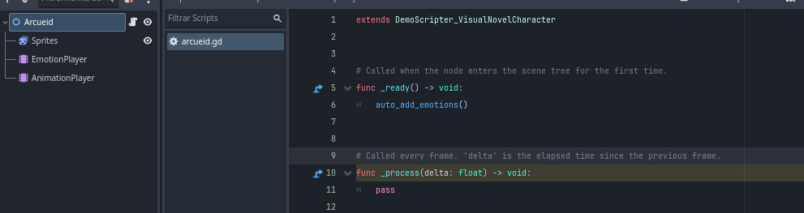

```gdscript
extends DemoScripter_VisualNovelCharacter


func _ready() -> void:
	auto_add_emotions()
```

And now, the arcued character example should be finished and ready to be added to a scene!

# Playing music or audio using the framework

In order to play music or audio, you use play_music for music or play_audio.

>[!NOTE]
>While theses functions do the same thing (play a audio), it's probably going to be changed in the future their functionality.

## Tsukihime music example

>[!NOTE]
>The following musics are from Tsukihime. Tsukihime is owned by TYPE-MOON. This is only for example purposes.
>I got the music files from accessing the CD folder from [ReadTsukihime's Tsukihime download page](https://www.readtsukihi.me/downloads).
>The musics is from Tsuki-Bako version of Tsukihime.
>The musics is located in the assets/musics in this doc folder.
>Keep in mind this example has nodes from Background handler section. It's not necessary to follow the background handler example to play music in DemoScripter.

This example showcases how to add and play musics from Tsukihime.

First, add a AudioStreamPlayer to your scene.

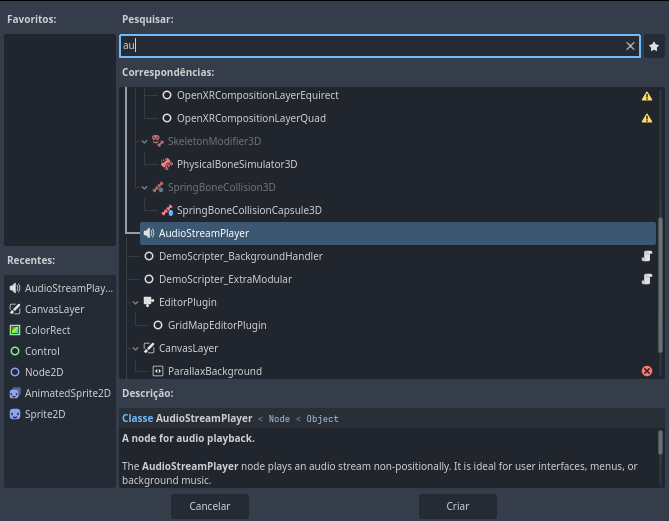

Then, rename the node to Music1.

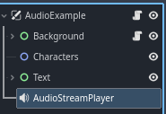

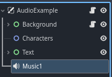

In this example, it will be used track01, track02 and track03 from Tsukihime. Because of that, duplicate the Music1 node two times. (CTRL + D)

In Music1, select track01 from docs/assets/musics.

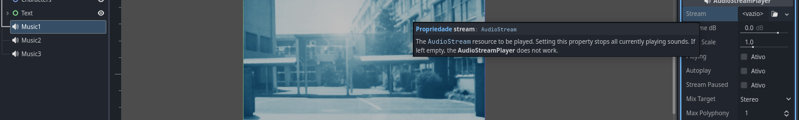

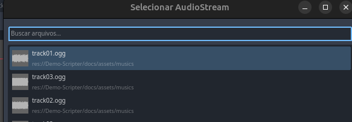

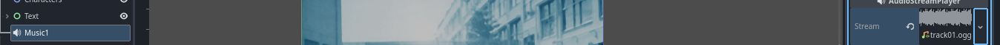

In Music2, select track02 and in Music3, select track03.

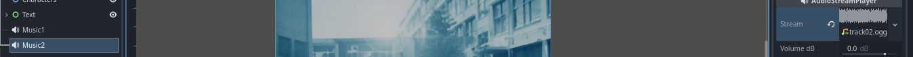

And done! Now you can use your music nodes using any music function from DemoScripter! (play_music, stop_music, etc)

If your music ins't looping, don't forget to set it as loopable in the reimport settings when you select a music file!

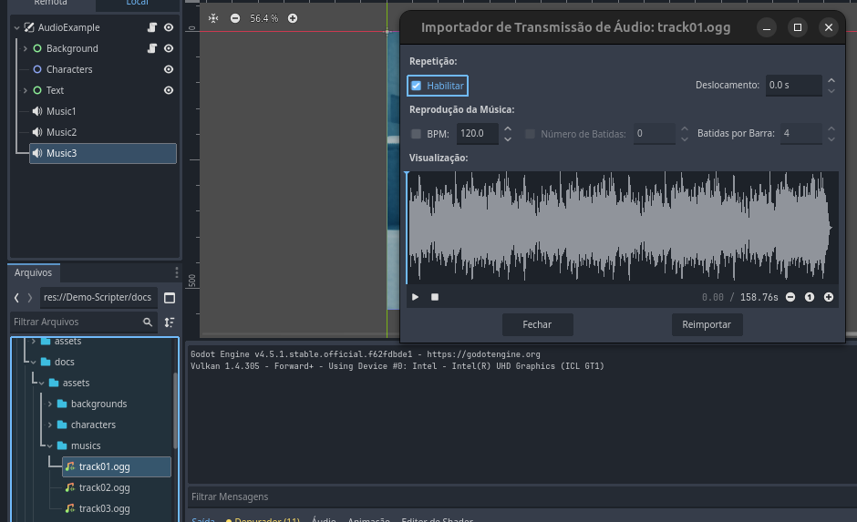

### Scene script example

This is a scene script example showcasing music functions.

- play_music - plays a music node
- stop_music - stops a music node
- pause_music - pauses a music node. When executing the function again on a paused music node, it resumes.
- set_music_pitch - sets a music node's pitch
- fadein_music - fades in a music node
- fadeout_music - fades out a music node

```gdscript
extends DemoScripter_VisualNovelScene

@onready var background: DemoScripter_BackgroundHandler = $Background

func _ready() -> void:
	add_dialogue_start("music example!")
	add_dialogue("playing track 1")
	add_dialogue_special(play_music, [$Music1])
	add_dialogue("working...")
	add_dialogue("playing track 2")
	add_dialogue_special(play_music, [$Music2])
	add_dialogue("as you can see, by default, it doesnt stop track 1")
	add_dialogue("it also doesnt trigger a fadein and fadeout dialogue animation!")
	add_dialogue("stopping both tracks")
	add_dialogue_special(stop_music, [$Music1])
	add_dialogue_special(stop_music, [$Music2])
	
	add_dialogue_next("playing track 1")
	add_dialogue_special(play_music, [$Music1])
	add_dialogue("in order to change to a different music and stop the previous one, you use stop_music with the name of the track you want to stop")
	add_dialogue("and the argument for both functions is a AudioStreamPlayer node, so you need to add a node with the track you want")
	add_dialogue("stopping track 1, playing track 2")
	add_dialogue_special(stop_music, [$Music1])
	add_dialogue_special(play_music, [$Music2])
	add_dialogue("stopping track 2, playing track 3")
	add_dialogue_special(stop_music, [$Music2])
	add_dialogue_special(play_music, [$Music3])
	add_dialogue("very cool....")
	
	add_dialogue_next("you can also pause musics, too")
	add_dialogue("pausing track03")
	add_dialogue_special(pause_music, [$Music3])
	add_dialogue("now its paused.....")
	add_dialogue("resuming track03")
	add_dialogue_special(pause_music, [$Music3])
	add_dialogue("now its resumed.....")
	add_dialogue("...yeah")
	
	add_dialogue_next("and set music pitchs, too")
	add_dialogue("setting to 1.25 pitch track03")
	add_dialogue_special(set_music_pitch, [$Music3, 1.25])
	add_dialogue("now its fast...")
	add_dialogue("1.50 pitch")
	add_dialogue_special(set_music_pitch, [$Music3, 1.50])
	add_dialogue("2 pitch")
	add_dialogue_special(set_music_pitch, [$Music3, 2])
	add_dialogue("3 pitch")
	add_dialogue_special(set_music_pitch, [$Music3, 3])
	add_dialogue("5 pitch")
	add_dialogue_special(set_music_pitch, [$Music3, 5])
	add_dialogue("10 pitch")
	add_dialogue_special(set_music_pitch, [$Music3, 10])
	add_dialogue("now back to 1")
	add_dialogue_special(set_music_pitch, [$Music3, 1])
	add_dialogue("damn, ngl, it feels kinda weird listening to tsukihime musics with different pitch")
	
	add_dialogue_next("setting to 0.9 pitch track03")
	add_dialogue_special(set_music_pitch, [$Music3, 0.9])
	add_dialogue("0.8 pitch")
	add_dialogue_special(set_music_pitch, [$Music3, 0.8])
	add_dialogue("0.7 pitch")
	add_dialogue_special(set_music_pitch, [$Music3, 0.7])
	add_dialogue("0.5 pitch")
	add_dialogue_special(set_music_pitch, [$Music3, 0.5])
	add_dialogue("0.3 pitch")
	add_dialogue_special(set_music_pitch, [$Music3, 0.3])
	add_dialogue("0.1 pitch")
	add_dialogue_special(set_music_pitch, [$Music3, 0.1])
	add_dialogue("now back to 1.0")
	add_dialogue_special(set_music_pitch, [$Music3, 1])
	add_dialogue("creepy....")
	
	add_dialogue_next("you can also fade out and fade in music, too")
	add_dialogue("fade out track03 with 3 duration")
	add_dialogue_special(fadeout_music, [$Music3, 3])
	add_dialogue("it slowly fades out")
	add_dialogue("fade in track03 with 3 duration")
	add_dialogue_special(fadein_music, [$Music3, 3])
	add_dialogue("slowly fades in")
	add_dialogue("by default, it doesnt pause the music once it reaches 0 in fade out")
	add_dialogue("its the same to fade in, too, where it doesnt resume the music where it stopped")
	add_dialogue("fade out track03 with 3 duration with pause")
	add_dialogue_special(fadeout_music, [$Music3, 3, {
		"pause": true
	}])
	add_dialogue("fade in track03 with 3 duration with pause")
	add_dialogue_special(fadein_music, [$Music3, 3, {
		"pause": true
	}])
	add_dialogue("now, it resumed!")
	add_dialogue("cool.....")
	
	add_dialogue_next("you can also make the fadein not set to 55 instantly and instead, go to volume 0 from current volume!")
	add_dialogue("fading in")
	add_dialogue_special(fadeout_music, [$Music3, 3, {
		"pause": true
	}])
	add_dialogue("fading out with no set to 55")
	add_dialogue_special(fadein_music, [$Music3, 3, {
		"pause": true,
		"set_node_volume_to_55": false
	}])
	add_dialogue("uhuh...")
	
	load_dialogue_start()

```
